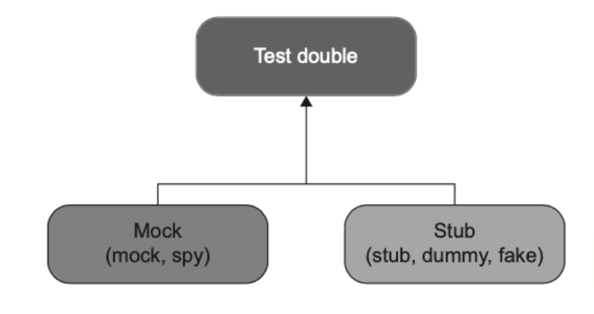
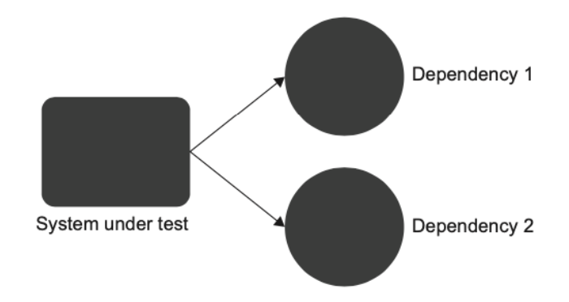
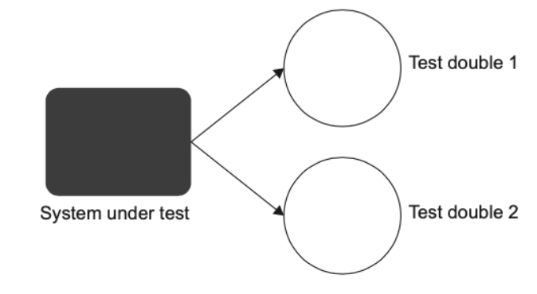
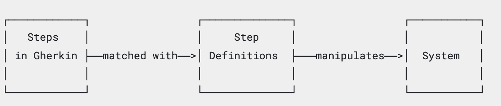
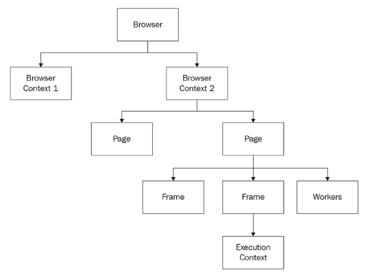
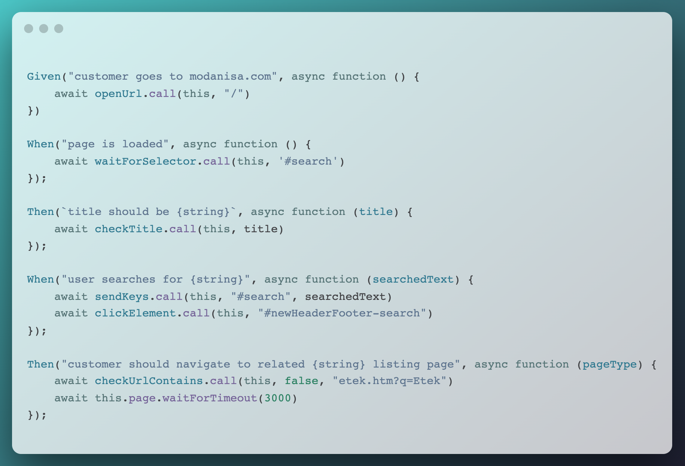

# ATDD

- What is Acceptance Testing?
- What is TDD?
- Unit test
- Test Doubles (mock, stub, spy)
- Given When Then Pattern
- What is Puppeteer?
- What is Cucumber?
- Our Acceptance Project Template

---

# What is Acceptance Testing?

* Acceptance tests are critical in an agile environment because they answer the questions, `“How do I know when I am done?”` for developers and `“Did I get what I wanted?”` for users.

* Acceptance criteria defines `“what needs to be done”` and acceptance tests define `“how it should be done.”` Acceptance tests are organized similar to the arrange-act-assert sections of a unit test. However, in acceptance tests, these sections are usually known as given-when-then. (Given) some context, (When) some action is carried out, (Then) a set of consequences should happen.

---

# What is TDD?

- **Test-driven development** is a software development process that relies on tests to drive the project development. The process consists of three stages, which you repeat for every test case:

1. Write a failing test to indicate which functionality needs to be added and `how it should behave`.
2. Write just enough code to make the test pass. At this stage, `the code doesn’t have to be elegant or clean.`
3. Refactor the code. **Under the protection of the passing test**, you can safely clean up the code to make it more readable and maintainable.

---

# Unit Test

- Remember, **you don’t test code, you test application behavior.**

- All unit tests should follow the **AAA pattern: arrange, act, assert.**

```c#
public void Purchase_succeeds_when_enough_inventory()
{
    // Arrange
    var store = new Store();
    store.AddInventory(Product.Shampoo, 10);
    var customer = new Customer();
    // Act
    bool success = customer.Purchase(store, Product.Shampoo, 5);
    // Assert
    Assert.True(success);
    Assert.Equal(5, store.GetInventory(Product.Shampoo));
}
```

---

# Test Doubles

* A **test double** is an overarching term that describes all kinds of non-production-ready, fake dependencies in tests.



---

# Test Doubles Cont.



* if a class has a dependency on another class, or several classes, you need to replace all such dependencies with test doubles.

---

# Test Doubles Cont.



* Replacing the dependencies of the system under test with test doubles allows you to focus on verifying the system under test exclusively. 

* One benefit of this approach is that if the test fails, you know for sure which part of the code base is broken: it's the system under test.

---

# Mocks & Stubs & Spy

* **Stub**: a dummy piece of code that lets the test run, but
you don't care what happens to it.

* **Mock**: a dummy piece of code that you VERIFY is called correctly as part of the test.

* **Spy**: a dummy piece of code, that intercepts some calls
to a real piece of code, allowing you to verify calls without
replacing the entire original object.

---

# Given-When-Then Pattern

You might have heard of the Given-When-Then pattern, which is similar to AAA. This pattern also advocates for breaking the test down into three parts:

```gherkin
Given = Arrange 
When  = Act     
Then  = Assert  
```

There’s no difference between the two patterns in terms of the test composition. The only distinction is that the **Given-When-Then structure is more readable to non- programmers.** Thus, Given-When-Then is more suitable for tests that are shared with non-technical people.

---

# What is Cucumber?

Cucumber reads executable specifications written in plain text and validates that the software does what those specifications say. The specifications consists of multiple examples, or scenarios. For example:
```gherkin
Scenario: Check Site Title
    Given customer goes to modanisa.com
    When page is loaded
    Then title should be "Modanisa | Tesettür ..."
```
Each scenario is a list of steps for Cucumber to work through. Cucumber verifies that the software conforms with the specification and generates a report indicating ✅ success or ❌ failure for each scenario.

**In order for Cucumber to understand the scenarios, they must follow some basic syntax rules, called `Gherkin`.**

---

# What are Gherkin & Step-Definition?

* Gherkin is a set of grammar rules that makes plain text structured enough for Cucumber to understand. The scenario above is written in Gherkin.

* Gherkin documents are stored in `.feature` text file

* `Step definitions` connect Gherkin steps to programming code. A step definition carries out the action that should be performed by the step. So step definitions hard-wire the specification to the implementation.



---

# What is Puppeteer?

Puppeteer is nothing more, and nothing less, than a Node.js package that knows how to open a browser, send commands, and react to messages coming from that browser.

The first thing you need to know is that `Puppeteer` was not created to compete with `Selenium`. `Selenium` is a cross-language, cross-browser testing tool, whereas Puppeteer was created as a multi-purpose automation tool to exploit all the power of Chromium.

---

# The Puppeteer Object Model



---

# The Puppeteer Object Model cont.

- A browser can contain more than one context. **A context is a browser session** (not to be confused with a browser window). The best example is the Incognito Mode or private mode, depending on the browser, which creates an isolated session inside the same browser process.

- A **page** is a tab in a browser or even a pop-up page.

- Every page has at least one frame, which is called the main frame. _(page.click calls mainframe.click)_

- The **execution context** is a mechanism Chromium uses to isolate the page from the browser extensions. **Each frame will have its own execution context.** Internally, all the frame functions that involve executing JavaScript code will use an execution context to run the code inside the browser.

---
# Init `puppeteer launch` function

```javascript
const defaultOptions = {
  args: ["--window-size=1920,1080"],
  defaultViewport: { width: 1920, height: 1080 },
  ignoreHTTPSErrors: true, headless: false
};
this.config = {
  ...defaultOptions, ...puppeteerOptions, ...this.worldParameters,
};
this.browser = await puppeteer.launch(this.config);
this.page = await this.browser.newPage();
```
- **ignoreHTTPSErrors**: Whether to ignore HTTPS errors during navigation. This option will become handy when you want to automate websites with invalid or missing SSL certificates.
- a **viewport** is the visible portion of the entire document.
- A **headless** browser is a browser that you can launch and interact with using a particular protocol over a particular communication transport, with no UI involved.

---

# Template

[Our Puppeteer & Cucumber Template](https://github.com/patheard/cucumber-puppeteer)

[Our Repo](https://github.com/modanisa/bootcamp-project-acceptance)

---

# Action Funcs

```
action
├── clickElement.js
├── deleteCookie.js
├── fileUpload.js
├── keyboardPress.js
├── openUrl.js
├── resizeScreenSize.js
├── scrollToElement.js
├── sendKeys.js
├── setElementStyle.js
├── setElementValue.js
├── setUserAgent.js
├── waitFor.js
└── waitForSelector.js
```

---

# Check Funcs

```
check
├── checkAccessibility.js
├── checkAttribute.js
├── checkAttributeContains.js
├── checkContainsText.js
├── checkCookieExists.js
├── checkCookieValue.js
├── checkElementEnabled.js
├── checkElementExists.js
├── checkElementValue.js
├── checkElementVisible.js
├── checkHasFocus.js
├── checkIsChecked.js
├── checkIsEmpty.js
├── checkScreenshot.js
├── checkTitle.js
├── checkTitleContains.js
├── checkUrl.js
└── checkUrlContains.js
```

---


