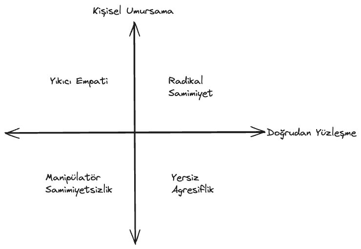
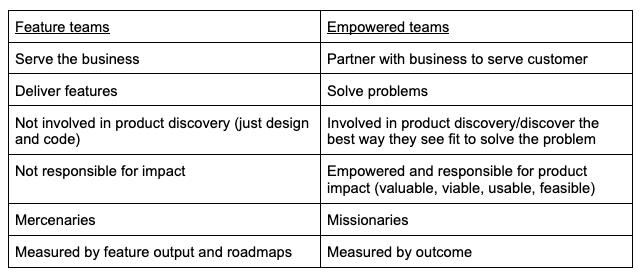

# Coaching Session

Abdulsamet İleri 

---

# Table of contents
- What have I done since the last session?
- My Analyse Points
- Consensus Building
- Radical Candor
- Empowered Product Teams
- Domain Driven Organization & Team topologies
- Future Roadmap

---

# What have I done

- My article named as **[Let's implement a basic hotel reservation system with 2PC using pessimistic and optimistic locks in Go](https://medium.com/stackademic/lets-implement-a-basic-hotel-reservation-system-with-2pc-using-pessimistic-and-optimistic-locks-in-581256d142e8)** published ✍️.

- Did presentation about **[Domain Driven Design](https://github.com/Abdulsametileri/slides/blob/main/domain-driven-design/domain-driven-design.md)** to product-offering teams *(~6 Team)* 🖥️.

- Finished `Consensus Building & Product Minded`, `Situational Leadership`, `Domain Driven Organization` and `Empowerd Product Teams` presentations on the leadership guild 🏫. 

- Finished **[Leadership and the One Minute Manager](https://www.amazon.com/Leadership-Minute-Manager-Updated-Effectiveness/dp/0062309447)** and **[Radical Candor](https://www.amazon.com/Radical-Candor-Kick-Ass-Without-Humanity/dp/1250103509)** 📚.

---

# My Analyse Points

---

# Consensus Building

- **Consensus** means coming to an agreement. Creating consensus in a team setting means finding a proposal acceptable enough that all team members can support it, **with no member opposing it**. ⚠️
<!--
Consensus oy çokluğu demek değildir, oy birliği demektir.

Consensus building’in en önemli faydalarından biri: kararda kişinin de görüşü alındığında ve kararda onun da katkısı olduğunda o kişinin commitment’i daha da artıyor.
-->

- Need to provide **trust environment** 🤝
<!--Son madde kritik ortada bir güven ortamı fikir beyan etmede çekingenlik olmaması gerekiyor. Mesela insanlar yeterli güveni hissetmediği zaman sessiz kalmayı tercih edebilir. -->

- How to change someone's mind? 🤔
<!-- 
Başkalarının fikrini siz değiştiremezsiniz, insanlar kendi fikirlerini ancak kendileri değiştirebilirler.

Alternatifleri konuşurken daima Pros dan başlayalım, cons’dan başlamayalım sebebi ise insan psikolojisi.
-->

- What Facilitators do for a process? 🤔

<!--
Varsayma!
Özel konuşulan şeyleri toplum içinde paylaşmayın.

Dikte etmeyin, bırakın ekip karar alsın.

Kimsenin psikologu değilsiniz. Adam karısıyla kavga edip vs. gelmiştir o anda yapabileceğiniz bir şey yok.

Tutamayacağınız sözler vermeyin.

Agreement’e zorlamayın.!!
-->

---

# Radical Candor

<!-- 
İnsanlar size güvendiklerinde ve onları gerçekten umursadığınızı bildiklerinde 
- takdir ve eleştirilerinize daha fazla değer verirler,
- size yaptıklarınızın sonuçları hakkında daha samimi geri bildirimde bulunurlar,
- birbirleriyle daha uyumlu hareket etme eğilimi gösterirler,
- ekip içindeki rollerine dört elle sarılırlar,
- sonuçlara odaklanırlar.
-->

<!-- 
Yıkıcı Empati: Ne zaman yalnızca nazik olmak ve karşınızdakini incitmemek içinbirisine geri bildirim vermekten kaçındınız?

Manipülatör Samimiyetsizlik: Nihayet ve belki de en zoru, ne zaman birine bir sorunu doğrudan söylemeyip bunun yerine başkaları ile konuştunuz?
-->

- How to ask for feedback? 🤔
<!--
Have a go-to question (önemli bir soru sorun)
evet hayır harici bir soru.

Embrace the discomfort (rahatsızlığı kuçaklayın)

Listen with the intent to understand, not to respond (tepki vermek niyetiyle değil, anlamak için dinleyin)

Reward criticism to get more of it (samimiyeti ödüllendirin)
 -->

- How can you criticize the other person without discouraging him? 🤔

<!-- 
Karşınızdakinin cesaretini kırmadan onu nasıl eleştirebilirsiniz?
- Eleştiriye açık olmak.
- Övgünün eleştireye kıyasla öncelikli olması.
- Alçak gönüllü olup, yardımcı olmaya çalışmak.
- Kişisel olarak yardım ve rehberlik teklif etmekten kaçınmaMAk.
- Övgüyü topluluk içinde, yergiyi bire bir yapmak.

En önemlisi kişileştirmeMEk. Problemin kaynağının, çözülmesi mümkün olmayan bir karakter eksikliğinden kaynaklanmadığını mutlaka ifade edin.
-->

- DDEA Method 🛠️

<!--
Durum: Spesifik konuyu söyleyin.
Davranış: Ne söylendiğini veya yapıldığını açıklayın.
Etki: Davranışın etkilerini açıklayın
Aksiyon: Davranışı değiştirmesi konusunda net aksiyonlar önerin.
 -->

<!-- Sen hatalısın yerine -> bu iş hatalı demek.-->

---

# Empowered Product Teams

- Eradicate the old idea that "Technology" is in service to the business. With this mindset, your business will not transform into a great Product company. ℹ️
  
<!-- Teknoloji ekibinin işi business ekibine hizmet etmektir şeklinde düşünüyorsanız siz iyi bir Product şirketi olamazsınız diyor yazar. -->

- What is **Empowered teams**? 🤔
<!--businessle colloborate edip müşteriye hizmet etmeye çalışırlar. Feature deliver etmekten ziyade problem çözmeye odaklanırlar. -->

<!--
Empower takım olabilmek için: Takımınızda rockstarlar süperstarlar yıldız oyuncular olmasına gerek yok; gücü akıtabilirsek ordinary insanlar bir şeyler çıkarabilirler. Burada coaching çok önemli.

Empower takımların olmazsa olmazı nelerdir?
1- Coaching: Remote dünyada özellikle çok önemli. Ekibine yeni product manager geldiği zaman onunla baya zaman geçirmeniz gerekiyor. Customer feedbackleri ürün vs.
2- Staffing: Doğru insanları bulmakta önemli. Bunları coach edip geliştirip sağlam takım arkadaşları haline getirmek. Recruitment HR aktivitesi olarak görülür; fakat bu bakış açısını değiştirmeniz lazım.
3- Product Vision: Recruitment yaparken en önemli silahınız product’ınız olmalı. İnsanlara bu vision ilham vermeli. lead ettiğiniz ürünü 1 yıl sonra nerede görüyorsunuz?
4- Product Strategy: Vision’a nasıl gidicez burada bir strateji lazım. Bu kolay bir şey değil. Öncelikle neyin önemli olduğuna karar vermek gerek. Data dan insightlar edilip, bunları aksiyona vs. dökmek gerekiyor.
5- Colloboration: Sadece product takımlarını empower etmek yeterli değil. Company-wide bir collaboration olması gerekiyor.

Asıl inovasyon teknoloji ekiplerinden gelir. O yüzden onları bu işin sürecine dahil etmelisiniz. Kafa yoran, müşteri için düşünen beyinler olmaya başladığımız an hepimiz o inovasyonu getirmeye başlıyoruz. Bu mesleği seçmemizin sebebi o. Biz problem çözmek için bu mesleği seçtik, birilerinin istediklerini kodlamak için değil.
-->

---

# Domain Driven Organization

- Strategic DDD
<!--Starbucks örneği, personel, effective location, not only coffe -->
  - Subdomains
    - Core <!-- Stream aligned teams -->
    - Generic <!-- Platform teams -->
    - Supporting <!--Compilicated Sub-system Teams-->
<!--
Şirketin stratejisi üzerinde önemli yere sayıp.
In-house, buy/adopt, outsource
 -->
  - Ubiquitious Language 
<!--
Ubiquitious language universal olmaması.
Sadece o bounded context sınırları içerisinde tek, kesin ve tutarlı olması.
 -->
  - Bounded Context & Context Map 
  <!--
  Knowledge discovery noktasında Eventstorming etkisi büyük.

  Problem space & solution space
  Subdomain discover edilir, bounded context design edilir.

  A bounded context’s size, by itself, is not a deciding factor. Models shouldn’t necessarily be big or small. Models need to be useful.

  The wider the boundary of the ubiquitous language is, the harder it is to keep it consistent. It may be beneficial to divide a large ubiquitous language into smaller, more manageable problem domains, but striving for small bounded contexts can backfire too. The smaller they are, the more integration overhead the design induces.

   Bir ekip birden fazla bounded context yönetebilir fakat bir bounded context’i birden fazla ekip yönetemez, orada sıkıntı çıkar iletişim ihtiyacı yaşanır.

  Context map, integrating patternslerin overviewde gösterimi.
  - Partnership (Beraber çalışıyolar)
  - Shared kernel (Ortak lib, authorization lib)
  - Conformist (Adamın modeline uyuyorsun)
  - Anticorruption Layer (Adamın modeline uymak yerine bi mapper yazmak gibi)
  - Open-Host Service (Anticorruption'ın tersi)
  -->

---

# Team topologies

- Stream aligned teams
- Platform teams
- Compilicated Sub-system Teams
- Enable Team
<!--
Stream aligned teams: En hızlı bir şekilde feature geliştirip release etmeye odaklanır. Diğer tipteki takımlarda stream aligned takımların cognitive load’ını düşürmeye odaklanır.
Platform teams: Stream aligned takımların ihtiyaç duyduğu platformları geliştirir ve long term de cost optimizasyonu ve delivery hızlarını hızlandıracak çözümler geliştirir.
Compilicated Sub-system Teams: Special knowledge sahibidirler ve niş konulara girerler. Vector search çözümüne ihtiyacımız var. Bu takım gelir bu konuda uzman phd level oldukları için takımımızla colloborate eder ve geliştirip bize getirir.
Enable Team: Stream aligned takımlarından enable’ini artırır. Mesela stream aligned team’ın test automation projesi yoktur bunlar geliştirir ve yol gösterirler.
 -->

<!--Team topologies de takımlar değerlendirilirken, DDD'de subdomainleri değerlendiriyoruz. -->

---

# Future Roadmap

---

Thank you ❤️❤️

<!-- 
Domain hakimiyetini artırmak ve insanlara güven aşılamak (sadece indexing'de değil, Ty için çalışıyorum.)
Product Mindset noktasında ilerlemek. (Inspired, Empowered kitapları sırada.)
Mentörlük ve colloboration kaslarını geliştirmek.
İnsanları influence etme noktasında kendimi geliştirmek.
-->