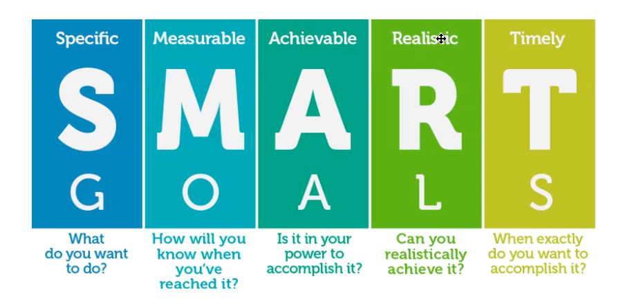
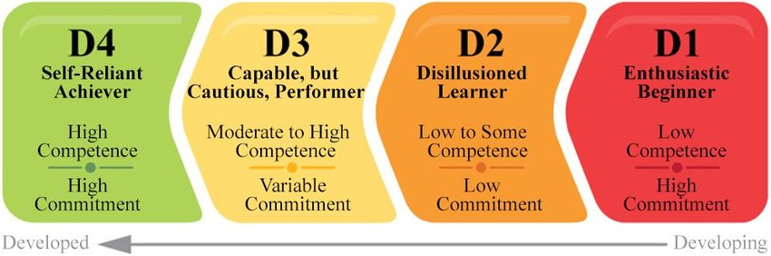
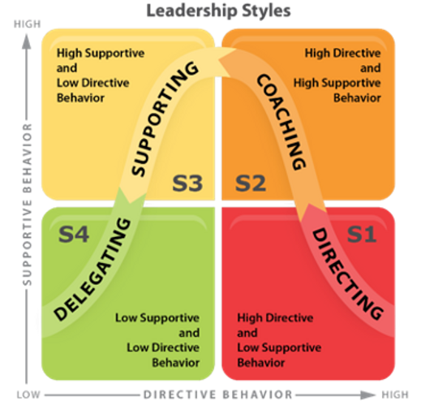

# Coaching Session

Abdulsamet İleri 

---

# Table of contents
- What have I done since the last session?
- Situational Leadership
- Consensus Building
- Radical Candor
- Empowered Product Teams
- Domain Driven Organization
- Future Roadmap

---

# What have I done

- My article named as **[Let's implement a basic hotel reservation system with 2PC using pessimistic and optimistic locks in Go](https://medium.com/stackademic/lets-implement-a-basic-hotel-reservation-system-with-2pc-using-pessimistic-and-optimistic-locks-in-581256d142e8)** published ✍️.

- Did presentation about **[Domain Driven Design](https://github.com/Abdulsametileri/slides/blob/main/domain-driven-design/domain-driven-design.md)** to product-offering teams *(~6 Team)* 🖥️.

- Finished `Consensus Building & Product Minded`, `Situational Leadership`, `Domain Driven Organization` and `Empowerd Product Teams` presentations on the leadership guild 🏫. 

- Finished **[Leadership and the One Minute Manager](https://www.amazon.com/Leadership-Minute-Manager-Updated-Effectiveness/dp/0062309447)** and **[Radical Candor](https://www.amazon.com/Radical-Candor-Kick-Ass-Without-Humanity/dp/1250103509)** 📚.

---

# Situational Leadership

<!--
Buradaki önemli faktör liderliği hedef bazlı gösteririz, kişi bazlı değil. 
-->

- Three skills: **Goal setting**, **diagnosis** and **matching**.
<!--Durumsal Lider olabilmek için 3 tane ögrenilmesi gereken yetenek vardır. -->

#### Goal Setting

<!--
- Belirli bir hedef olmalı,
- Ölçülebilir bir hedef olmalı,
- Ulaşılabilir bir hedef olmalı
- Realistic veya relavant olmalı yani bu adamın işi ile alakalı olmalı gidipte developerdan 100metreyi 3sn de koşmasını beklemezsin onun görevi koşmak değil, kod yazmak aslında. Bu hedefe ulaşabilmek için relavant’a sahip misin.
- Bir zamanı olmalı.
-->

--- 

#### Diagnosis
<!--Her hedef’n bir development level’ı var. İkinci aşama da bunu belirlemek lazım.-->

- **Competence**: can be developed with direction and support. Its not something you're born with. It's something that is learned.
- **Commitment**: is a combination of `confidence` and `motivation`. 
<!--
Confidence: Herhangi bir direction olmadan, bir taskı iyi yapabilme becerisi
Motivation: Kişinin ilgisi, taskı yapma isteği
-->

<!--
D1: yetkinliğin yok yeterli skill’in yok ama yapabileceğine inanıyorsun. Hevesli bir junior, işe yeni başlamış biri aslında.
D1 kesinlikle yeteneği potansiyeli yok demek değil. Bu kişinin potensiyeli var high-performer olacak fakat şu an için tecrübesi eksik

D2: Biraz yetkinliği var fakat biraz motivasyonu vs. düşük.  

D3: Self direction’u var siz yönlendirmesiniz bile. Motivasyonu çok değişken bügün iyi bügün kötü, Konudan konuya hâli değişiyor. Bazı zamanlar çekingen. Variable commitment bu yani.

D4: Oldum ben adamıdır. Yetkinliğim ve bağlılığım var. Benimle hiç uğraşmana gerek yok işi ver, git.

Rollere göre D1,D4 belirleyemeyiz. Senior D1, Junior D4.
-->

--- 

#### Matching

<!-- 
Arttış ve azalış bakımından 2 dimension’da inceliyoruz. Directive Behavior ve Supportive Behaviour.

Directing: Sen bunu yap, bunu burdan al yani bu adamı mikromanage ediyo ve kararları çoğu liderin kendi alıyor direktif veriyor. Adam düşünmüyor, yapıyor. Mesela D1 Junior yapabiliriz. Yetkinliği kazandırmak demek neyi nasıl yapacağını göstererek yapabiliriz.

Coaching: Kişinin düşmüş motivasyonu tekrar ayağa kaldırılıyor, gazlanıyor. Kişiyi çözüm aşamasına dahil ediyoruz karar vermeye vs. Fakat final decision’u yine leader veriyor.

Supporting: Artık sadece motivasyonu yükseltiyoruz çünkü competence var. Neyi nasıl yapacağını biliyor. Motivasyon olarak desteklenmeye ihtiyacı var. Mesela problem esnasında open-minded sorular soruyoruz.

Delegating: İş ver yapıyor zaten. 

D1 e S1, D2 ye S3, D3 e S3, D4 e S4 uygulamak gerekir.

Gidip D4 adamı S1 uygularsan o adam kaldıramaz işten çıkar.

Bir kişinin development leveli değişken bir kere verdin hep öyle liderlik yapmayacaksın. Değiştikçe sen de lider olarak değişmelisin
 -->

 - SLII Leadership is not something you do to people. It's something **you do with people**. ℹ️

--- 

# Consensus Building

- **Consensus** means coming to an agreement. Creating consensus in a team setting means finding a proposal acceptable enough that all team members can support it, **with no member opposing it**. ⚠️
<!--
Consensus oy çokluğu demek değildir, oy birliği demektir.

Consensus building’in en önemli faydalarından biri: kararda kişinin de görüşü alındığında ve kararda onun da katkısı olduğunda o kişinin commitment’i daha da artıyor.
-->

- Need to provide **trust environment** 🤝
<!--Son madde kritik ortada bir güven ortamı fikir beyan etmede çekingenlik olmaması gerekiyor. Mesela insanlar yeterli güveni hissetmediği zaman sessiz kalmayı tercih edebilir. -->

- How to change someone's mind? 🤔
<!-- 
Başkalarının fikrini siz değiştiremezsiniz, insanlar kendi fikirlerini ancak kendileri değiştirebilirler.

Alternatifleri konuşurken daima Pros dan başlayalım, cons’dan başlamayalım sebebi ise insan psikolojisi.
-->

- What Facilitators do for a process? 🤔

<!--
Varsayma!
Özel konuşulan şeyleri toplum içinde paylaşmayın.

Dikte etmeyin, bırakın ekip karar alsın.

Kimsenin psikologu değilsiniz. Adam karısıyla kavga edip vs. gelmiştir o anda yapabileceğiniz bir şey yok.

Tutamayacağınız sözler vermeyin.

Agreement’e zorlamayın.!!
-->

---

# Radical Candor