# Table Of Contents
  - What is DDD, business domain, subdomain?
  - What is ubiquitious language and bounded context?
  - Integrating Bounded Contexts (ACL, Open Host etc)
  - Context Map
  - Value, Entity, Agggregate and Aggregate roots?
  - Domain events, Domain services
  - Event storming
  - Architectural Patterns (Layered, ports & adapters, CQRS)
  - Integrating Patterns (Outbox, Saga)

# What is DDD?

**Domain-Driven design** is an approach to software development that centers the development on programming a domain model that has a rich understanding of the processes and rules of a domain. *Martin Fowler*

The domain-driven design (DDD) methodology can be divided into two main parts: **strategic design** and **tactical design**. 
- The strategic aspect of DDD deals with answering the questions of **“what?” and “why?”**—what software we are building and why we are building it. 
- The tactical part is all about the **“how”**—how each component is implemented

---

# DDD Mind Map

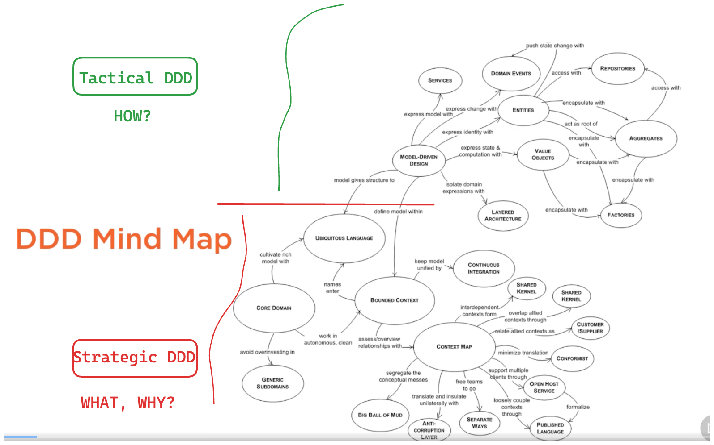

**Note:** DDD aims to tackle business complexity, not technical complexity.

---

# What is business domain?

A business domain defines a company’s main area of activity. Generally speaking, **it’s the service the company provides to its clients**.

Starbucks -> is best known for its coffee.
Amazon -> provides both retail and cloud services.
FedEx -> provides courier delivery.

# What is subdomain?

To achieve its business domain’s goals and targets, a company has to operate in multiple subdomains.

<!--
Starbucks may be most recognized for its coffee, but building a successful coffeehouse chain requires more than just knowing how to make great coffee. You also have to buy or rent real estate at effective locations, hire personnel, and manage finances, among other activities. **None of these subdomains on its own will make a profitable company. All of them together are necessary for a company to be able to compete in its business domain(s)**.
-->

## Types of subdomains

Just as a software system comprises various architectural components—databases, frontend applications, backend services, and others—subdomains bear different strategic/business values. 

Domain-driven design distinguishes between three types of subdomains: **core, generic, and supporting.**

**A core subdomain** is what a company does differently from its competitors. This may involve inventing new products or services or reducing costs by optimizing existing processes.

**A generic subdomain**: Generic subdomains are business activities that all companies are performing in the same way. *(Using existent authentication mechanism)*

**Supporting subdomain**: Supporting subdomains support the company’s business. However, contrary to core subdomains, supporting subdomains do not provide any competitive advantage. (ETL, CRUD processes.)

### Example

**BusVNext** is a public transportation company. It aims to provide its customers with bus rides that are comfortable, like catching a cab. The company manages fleets of buses in major cities.

A BusVNext customer can order a ride through the mobile app. At the scheduled departure time, a nearby bus’s route will be adjusted on the fly to pick up the customer at the specified departure time. 

The company’s major challenge was implementing the routing algorithm.

From time to time, BusVNext issues special discounts, both to attract new customers and to level the demand for rides over peak and off-peak hours.

**Core Subdomain**
• Routing
• Analysis
• Mobile app user experience
• Fleet management

**Generic Subdomain**
• Traffic conditions *(using 3rd party maybe)*
• Accounting
• Billing
• Authorization

**Supporting Subdomain**
• Managing promos and discounts supports the company’s core business

**Note**: Knowing the subdomains at play and the differences between their types;

• The routing algorithm, data analysis, fleet management, and app usability have to be implemented **in-house** using the most elaborate technical tools and patterns.
• Implementation of the promotions management module can be **outsourced**.
• Identifying traffic conditions, authorizing users, and managing financial records and transactions can be offloaded to **external service providers**.

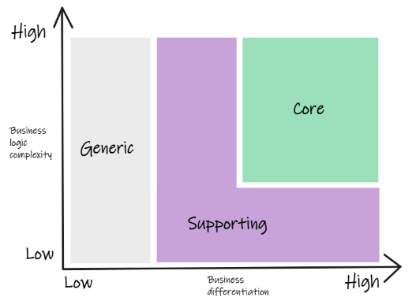

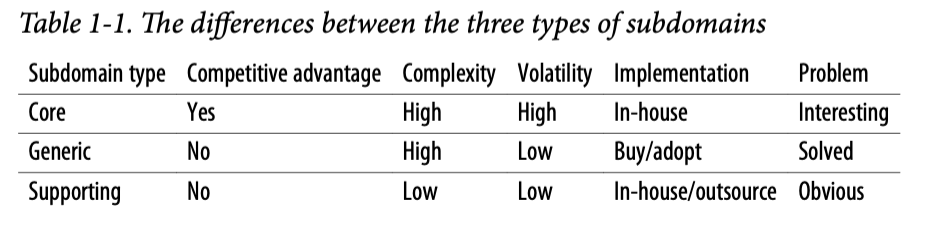

# Knowledge Discovery

- At every level, because of translation, some information is lost. 
- Wrong solution or right solution to the wrong problem.
- DDD proposes a better way to get the knowledge from domain experts to software engineers: by using **a ubiquitous language.**

# What is ubiquitous language?

- All project-related stakeholders—software engineers, product owners, domain experts, UI/UX designers—should use the **ubiquitous language** when describing the business domain.

- Should be business-domain related terms only. Not techical jargon.

- Must be **precise** and **consistent**.

- Each term of the ubiquitous language should have **one and only one meaning**.

- Tools such as wiki-based **glossaries** and **Gherkin tests** can greatly alleviate the process of documenting and maintaining a ubiquitous language.

## Example

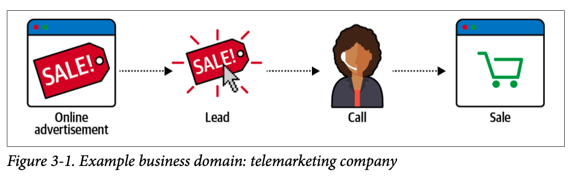

<!-- A lead is a person who has a potential interest in your product or service. -->

**Marketing Department** = Potential customer
**Sales Department** =  customer that a salesperson can connect with and start the selling process.

Same keyword, two different meaning.. :thinking: How we define lead term for marketing and sales department?

- Solution One: design a single model that can be used for all kinds of problems.

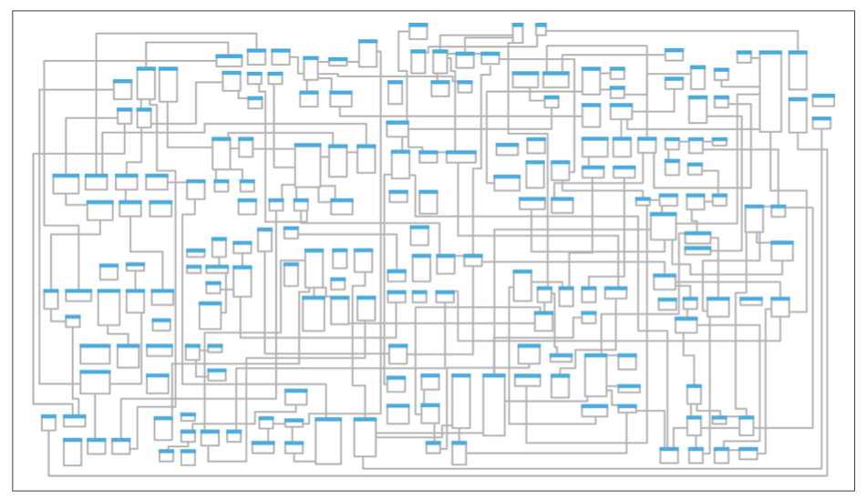

- Solution Two: would be to prefix the problematic term with a definition of the context: **“marketing lead”** and **“sales lead.”** That would allow the implementation of the two models in code. 
  - Cognitive load
  - No one would use the prefixes in conversations.

Let’s turn to the domain-driven design pattern for tackling such scenarios: **the bounded context** pattern.

# What is bounded context?

- Divide the ubiquitous language into multiple smaller languages, then assign each one to the explicit context in which it can be applied: its bounded context.

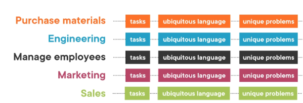

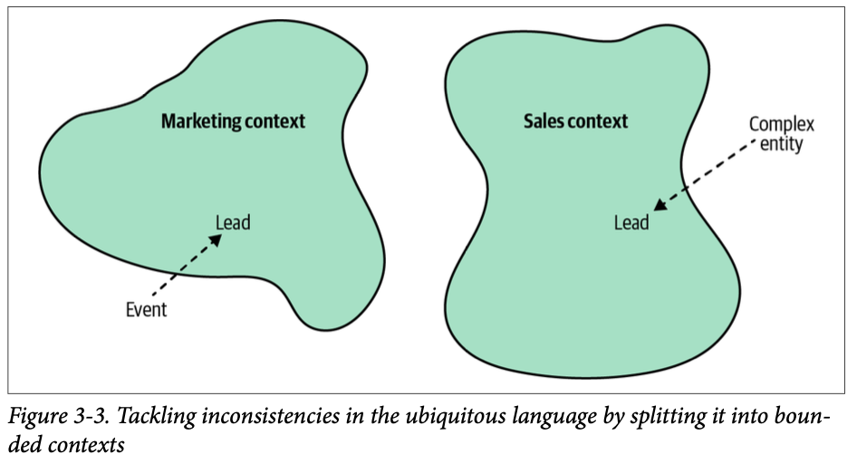

- A ubiquitous language is not “ubiquitous” in the sense that it should be used and applied “ubiquitously” throughout the organization. **A ubiquitous language is not universal.**
Instead, **a ubiquitous language is ubiquitous only in the boundaries of its bounded context.** The language is focused on describing only the model that is encompassed by the bounded context.

- A bounded context’s size, by itself, is not a deciding factor. Models shouldn’t necessarily be big or small. Models need to be useful. 

- The wider the boundary of the ubiquitous language is, the harder it is to keep it consistent. It may be beneficial to divide a large ubiquitous language into smaller, more manageable problem domains, but striving for small bounded contexts can backfire too. The smaller they are, the more integration overhead the design induces.

**Note**: Whenever we stumble upon an inherent conflict in the domain experts’ mental models, **we have to decompose the ubiquitous language into multiple bounded contexts.** A ubiquitous language should be consistent within the scope of its bounded context. However, across bounded contexts, the same terms can have different meanings.

# What is the difference between Subdomain and bounded context?

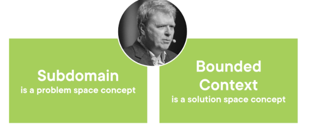

- **While subdomains are discovered, bounded contexts are designed.** The division of the domain into bounded contexts is a **strategic design decision**.

# Integrating Bounded Contexts

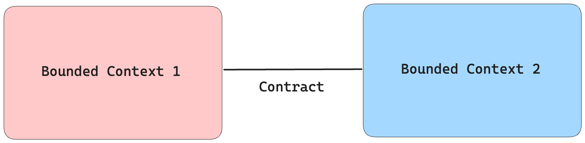

- **Cooperation**
  - Partnership <!--Beraber çalışıyolar -->
  - Shared kernel <!--Ortak lib, authorization lib -->
- **Customer - Supplier**
  - Conformist <!--Adamın modeline uyuyorsun -->
  - Anticorruption Layer <!--Adamın modeline uymak yerine bi mapper yazmak gibi -->
  - Open-Host Service <!--Anticorruption'ın tersi -->

# Context Map

- The **context map** is a visual representation of the system’s bounded contexts and the integrations between them.

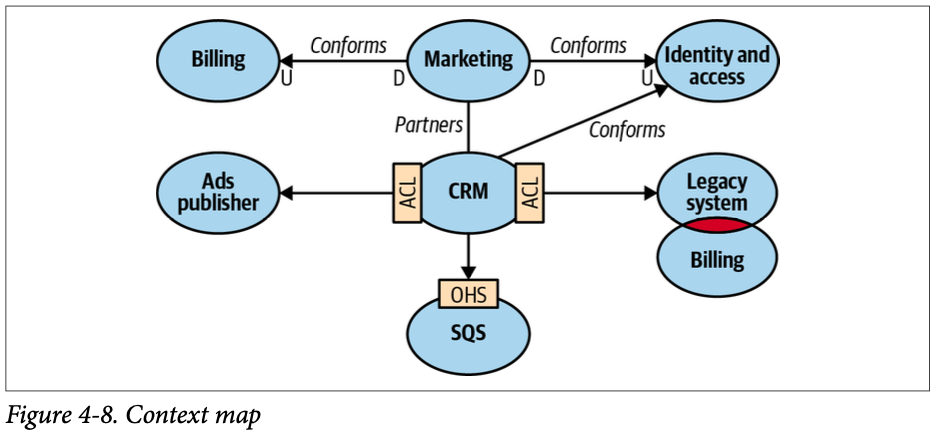

[Indexing Context Map](https://lucid.app/lucidchart/fd87ba52-b26b-4ffa-a34f-c7edf86cb1ab/edit?viewport_loc=-1640%2C712%2C3600%2C1597%2C0_0&invitationId=inv_d5053c74-2a58-41b8-a897-e13787c95b23)

The integrations among the bounded contexts can be plotted on a context map. **This tool gives insight into the system’s high-level design, communication patterns, and organizational issues.**

<!--what/why kısmını tartıştık, şimdi how kısmına geçebiliriz -->

# Tactical Design

<!--Hayatımız her zaman CRUD olmuyor, complex business süreçlerini kodlamaya ihtiyacımız oluyor. Bunun içinde
domain model pattern'i sunuluyor -->

**The domain model pattern** is intended to cope with cases of complex business logic. Here, instead of CRUD interfaces, we deal with complicated state transitions, business rules, and invariants *(rule in our domain that must always be true)*

**A domain model is** an object model of the domain that incorporates both behavior and data. 

DDD’s tactical patterns *—aggregates, value objects, entities, domain events, and domain services—* are the building blocks of such an object model.

All of these patterns share a common theme: **they put the business logic first**.

# What is Value Objects?
- Measures, quantifies, or describes a thing in a domain. <!--color rgb den oluşur -->
- Identity on based on composition values. Do not require an explicit ID field <!--color rgb -->
- Immutable
- Compared using all values
- No side effects

String is a value object. (replaceAll, toUpper, toLower)
Money is a value object.
Dates are a classic value object and there’s all kinds of logic with them. *(Eric Evans)*

---
<!--ubiqitious language sağlamalıyız. -->

Relying exclusively on the language’s standard library’s primitive data types—such as strings, integers, or dictionaries—to represent concepts of the business domain is known as the [primitive obsession](https://wiki.c2.com/?PrimitiveObsession) code smell.

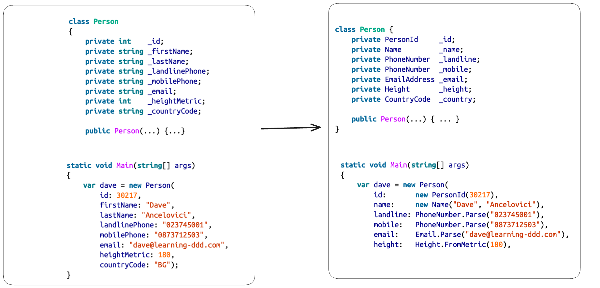

---

# What is Entity?

**An entity** is the opposite of a value object. It requires an explicit identification field to distinguish between the different instances of the entity.

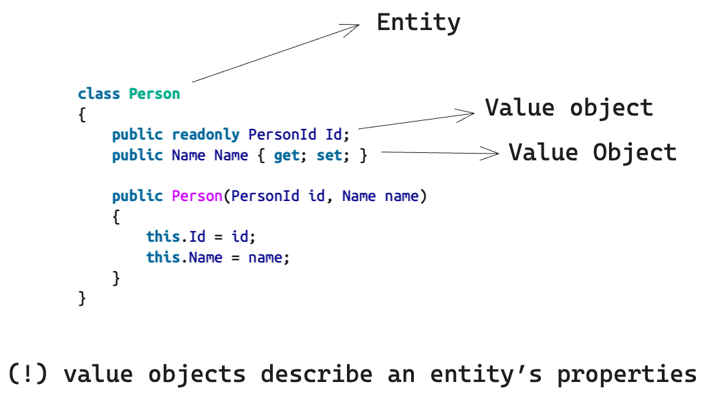

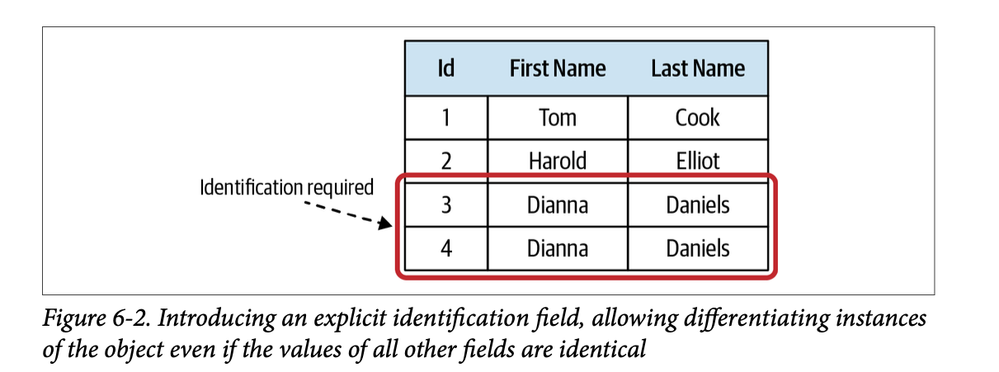
<!--Propertyleri aynı demek, anyı obje demek değiller işte. -->

- Contrary to value objects, entities are not immutable and are expected to change.

---

### **How we can decide domain object value or entity?**

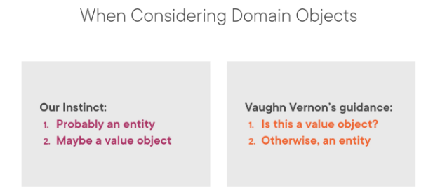

Try and make everything a value object to start with until it does not fit your use case. At that point, it can be upgraded to an entity.

# What is aggregate?

**The aggregate pattern** refers to a group of domain objects that can be treated as one for some behaviors. Some examples of aggregate patterns are:

- **An order**: Typically, an order consists of individual items, but it is helpful to treat them as a single thing (an order) for some purposes within our system.

- **A team**: A team consists of many employees. In our system, we would likely have a domain object for employees, but grouping them and applying behaviors to them as a team would be helpful in situations such as organizing departments.

- **A wallet**: Typically, a wallet (even a virtual one) contains many cards and potential currencies for many countries and maybe even cryptocurrencies! We may want to track the value of the wallet over time, and to do that; we may treat the wallet as an aggregate.

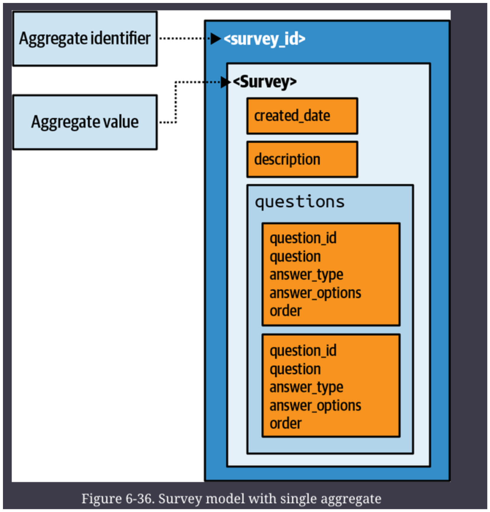

Since an aggregate’s state can only be modified by its own business logic, the aggregate also acts as a **transactional boundary**. All changes to the aggregate’s state should be committed transactionally as one atomic operation. If an aggregate’s state is modified, either all the changes are committed or none of them is.

--- 

## What is Aggregate root?
Since an aggregate represents a hierarchy of entities, only one of them should be designated as the aggregate’s public interface—the aggregate root.

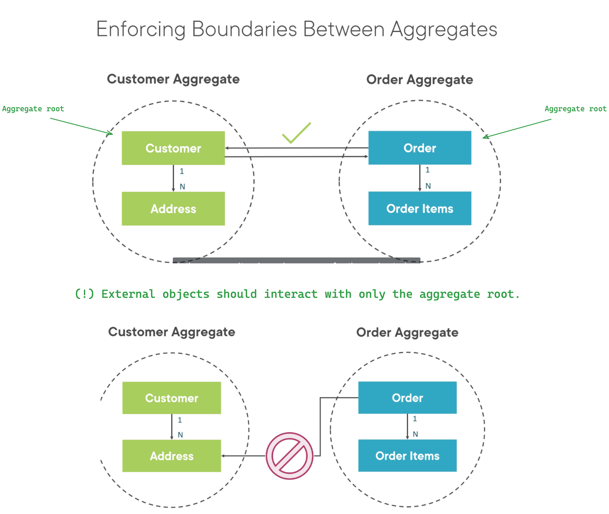

<!-- Order addresi almak istiyorsa Addres’e doğrudan bağlanmamalı. Agreegate root üzerinden iletişimi kurmalı. Addres’e aggregate dışından bağlantı kurulmamalı. -->

<!-- aggregate root test ederken kendimize şunu sorarız ben bunu silsem diğer objelerinde silinmesi gerekir mi? Appointment sildin ya mesela doktor da mı silincek gibi. -->

- Aggregate root is responsible for maintaining the rules of the aggregate!

- Aggregates should reflect the ubiquitous language. The terminology that is used for the aggregate’s name, its data members, its actions, and its domain events all should be formulated in the bounded context’s ubiquitous language.

### What is the domain events?

- A record of business-significant occurence within a Bounded Context. *OrderPlacedEvent, OrderCanceledEvent.*

<!-- zaten gerçekleşmiş event oldukları için past tense isimlendirilme yapılır -->

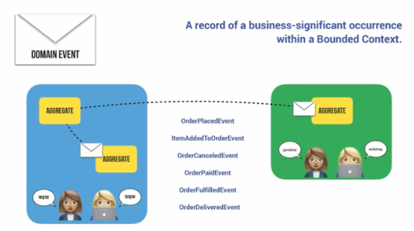

- Use a domain event to capture an occurrence of something that happened in the domain. (Vaugh Vernon)

<!--Burada event sourcing'den örnek verilebilir. Geleneksel state'i sürekli override etmek
yerine, tüm state değişimleri versionlayıp teker teker store ediyoruz. -->

---

## What is the domain services?

- Sooner or later, you may encounter business logic that either doesn’t belong to any aggregate or value object, or that seems to be relevant to multiple aggregates. In such cases, domain-driven design proposes to implement the logic as **a domain service**.

- A domain service is a stateless object that implements the business logic. In the vast majority of cases, such logic orchestrates calls to various components of the system to perform some calculation or analysis.

---

# Event Storming

**EventStorming** is a fun and engaging workshop that uses colorful sticky notes to quickly visualize the building blocks of the flows that make up your application. 

It **intends to uncover as many of the implicit details locked away in the heads of a few people and share that knowledge with domain experts and developers alike.** The workshop is made up of a series of steps that expand on the work that came before to build a visual representation of a domain or problem

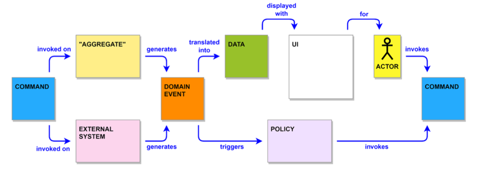

---

## Architectural Patterns

### Layered architecture

<!-- her layerin bir görevi var bunu interfaceler aracılığı ile konuşturuyosun.
bir katmanda değişiklik diğerini etkilemiyor. reusability sağlayabiliyorsun. Fakat burada technical bir decomposition var. business logic ile data access implementation beraber burada.
 -->

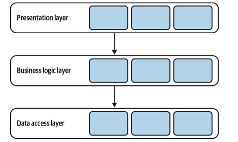

### Ports & Adapters (Hexagonal architecture)

- The ports & adapters architecture addresses the shortcomings of the layered architecture and is a better fit for implementation of **more complex business logic**.

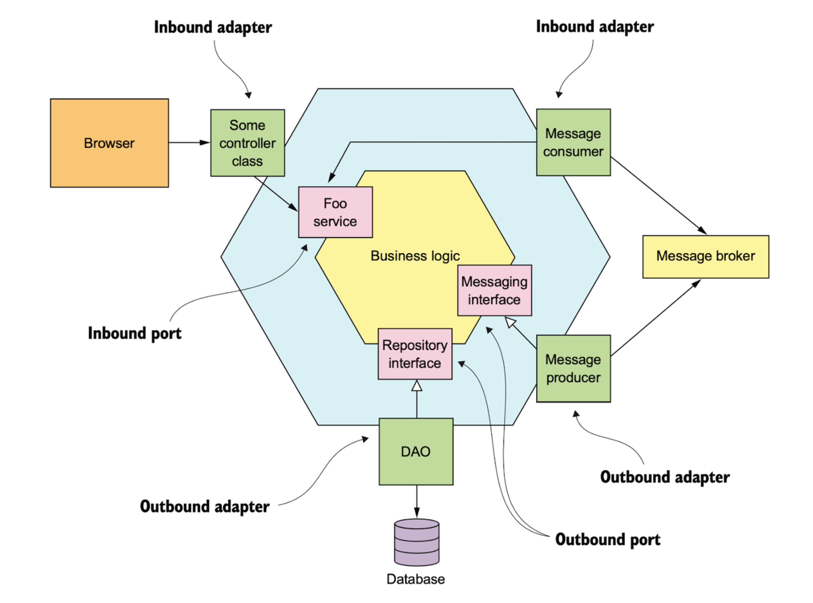

<!--Business logic'i merkeze koyuyor ve infra yı ayırıyor. -->

---

### Command-Query Responsibility Segragation (CQRS)

- The command-query responsibility segregation (CQRS) pattern is based on **the same organizational principles for business logic and infrastructural concerns as ports & adapters.** It differs, however, in the way the system’s data is managed. The CQRS pattern represents the same data in multiple models.

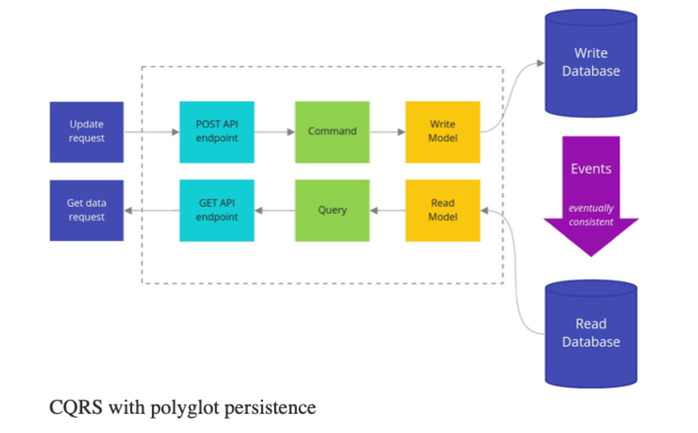

We need to do polygot modeling. Why? :thinking:

Because a single system might use **a document store** as its operational database, **a column store** for analytics/reporting, and **a search engine** for implementing robust search capabilities. 

**There is no perfect database!!**

---

## Integrating Patterns

### Outbox Pattern

- The outbox pattern ensures reliable publishing of domain events.

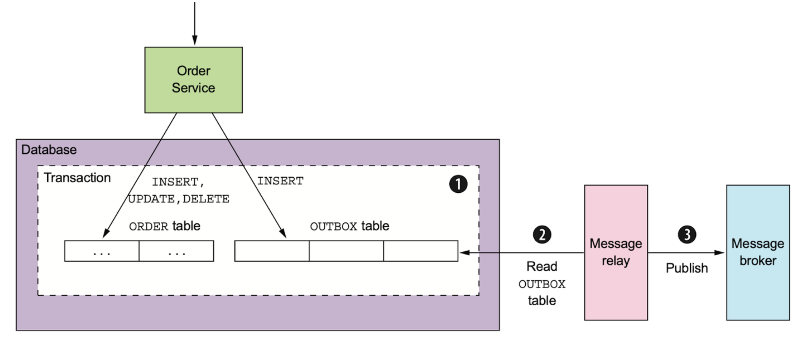

A service reliably publishes a message by inserting it into an OUTBOX table as part of the **transaction** that updates the database. The Message Relay reads the OUTBOX table and publishes the messages to a message broker.

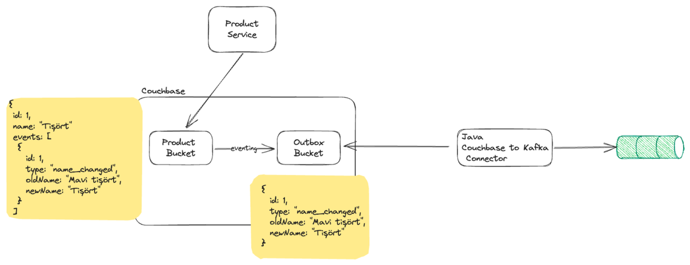

- Debezium, LinkedIn databus, DynamoDB streams

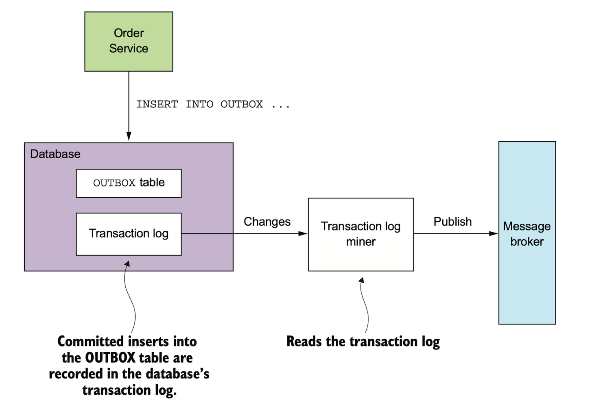

<!--WAL, cdc den bahsedelim.-->

### Saga

- A saga is a long-running business process.

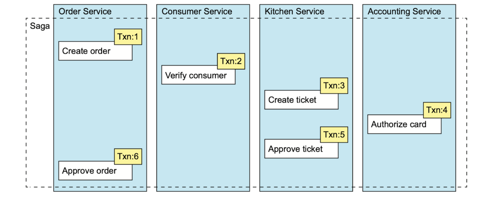

- The basic principle of the saga pattern is a simple one; for each action we take within our system, we also define a **compensating action** that we call in the event we need to roll back

- When a step of a saga fails because of a business rule violation, the saga must explicitly undo the updates made by previous steps by executing compensating transactions. 

**The outbox pattern** is a reliable way to publish aggregates’ domain events. It ensures that domain events are always going to be published, even in the face of different pro‐ cess failures.

**The saga pattern** can be used to implement simple cross-component business pro‐ cesses. More complex business processes can be implemented using the process man‐ ager pattern. Both patterns rely on asynchronous reactions to domain events and the issuing of commands.