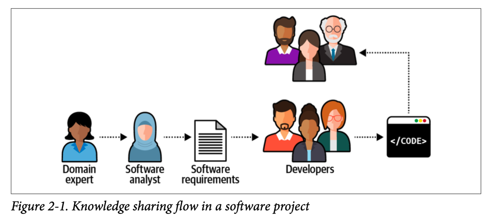

# What is DDD?

**Domain-Driven design** is an approach to software development that centers the development on programming a domain model that has a rich understanding of the processes and rules of a domain. *Martin Fowler*

The domain-driven design (DDD) methodology can be divided into two main parts: **strategic design** and **tactical design**. 
- The strategic aspect of DDD deals with answering the questions of **“what?” and “why?”**—what software we are building and why we are building it. 
- The tactical part is all about the **“how”**—how each component is implemented

# What is business domain?

A business domain defines a company’s main area of activity. Generally speaking, **it’s the service the company provides to its clients**.

Starbucks -> is best known for its coffee.
Amazon -> provides both retail and cloud services.
FedEx -> provides courier delivery.

# What is subdomain?

To achieve its business domain’s goals and targets, a company has to operate in multiple subdomains.

<!--
Starbucks may be most recognized for its coffee, but building a successful coffeehouse chain requires more than just knowing how to make great coffee. You also have to buy or rent real estate at effective locations, hire personnel, and manage finances, among other activities. **None of these subdomains on its own will make a profitable company. All of them together are necessary for a company to be able to compete in its business domain(s)**.
-->

## Types of subdomains

Just as a software system comprises various architectural components—databases, frontend applications, backend services, and others—subdomains bear different strategic/business values. 

Domain-driven design distinguishes between three types of subdomains: **core, generic, and supporting.**

**A core subdomain** is what a company does differently from its competitors. This may involve inventing new products or services or reducing costs by optimizing existing processes.

**A generic subdomain**: Generic subdomains are business activities that all companies are performing in the same way. *(Using existent authentication mechanism)*

**Supporting subdomain**: Supporting subdomains support the company’s business. However, contrary to core subdomains, supporting subdomains do not provide any competitive advantage. (ETL, CRUD processes.)

### Example

**BusVNext** is a public transportation company. It aims to provide its customers with bus rides that are comfortable, like catching a cab. The company manages fleets of buses in major cities.

A BusVNext customer can order a ride through the mobile app. At the scheduled departure time, a nearby bus’s route will be adjusted on the fly to pick up the customer at the specified departure time. 

The company’s major challenge was implementing the routing algorithm.

From time to time, BusVNext issues special discounts, both to attract new customers and to level the demand for rides over peak and off-peak hours.

**Core Subdomain**
• Routing
• Analysis
• Mobile app user experience
• Fleet management

**Generic Subdomain**
• Traffic conditions *(using 3rd party maybe)*
• Accounting
• Billing
• Authorization

**Supporting Subdomain**
• Managing promos and discounts supports the company’s core business

**Note**: Knowing the subdomains at play and the differences between their types;

• The routing algorithm, data analysis, fleet management, and app usability have to be implemented **in-house** using the most elaborate technical tools and patterns.
• Implementation of the promotions management module can be **outsourced**.
• Identifying traffic conditions, authorizing users, and managing financial records and transactions can be offloaded to **external service providers**.

# Knowledge Discovery

- At every level, because of translation, some information is lost. 
- Wrong solution or right solution to the wrong problem.
- DDD proposes a better way to get the knowledge from domain experts to software engineers: by using **a ubiquitous language.**

# What is ubiquitous language?

- All project-related stakeholders—software engineers, product owners, domain experts, UI/UX designers—should use the **ubiquitous language** when describing the business domain.

- Should be business-domain related terms only. Not techical jargon.

- Must be **precise** and **consistent**.

- Each term of the ubiquitous language should have **one and only one meaning**.

- Tools such as wiki-based **glossaries** and **Gherkin tests** can greatly alleviate the process of documenting and maintaining a ubiquitous language.

## Example

<!-- A lead is a person who has a potential interest in your product or service. -->

**Marketing Department** = Potential customer
**Sales Department** =  customer that a salesperson can connect with and start the selling process.

Same keyword, two different meaning.. :thinking: How we define lead term for marketing and sales department?

- Solution One: design a single model that can be used for all kinds of problems.

- Solution Two: would be to prefix the problematic term with a definition of the context: **“marketing lead”** and **“sales lead.”** That would allow the implementation of the two models in code. 
  - Cognitive load
  - No one would use the prefixes in conversations.

Let’s turn to the domain-driven design pattern for tackling such scenarios: **the bounded context** pattern.

# What is bounded context?

- Divide the ubiquitous language into multiple smaller languages, then assign each one to the explicit context in which it can be applied: its bounded context.

- A ubiquitous language is not “ubiquitous” in the sense that it should be used and applied “ubiquitously” throughout the organization. **A ubiquitous language is not universal.**
Instead, **a ubiquitous language is ubiquitous only in the boundaries of its bounded context.** The language is focused on describing only the model that is encompassed by the bounded context.

- A bounded context’s size, by itself, is not a deciding factor. Models shouldn’t necessarily be big or small. Models need to be useful. 

- The wider the boundary of the ubiquitous language is, the harder it is to keep it consistent. It may be beneficial to divide a large ubiquitous language into smaller, more manageable problem domains, but striving for small bounded contexts can backfire too. The smaller they are, the more integration overhead the design induces.

**Note**: Whenever we stumble upon an inherent conflict in the domain experts’ mental models, **we have to decompose the ubiquitous language into multiple bounded contexts.** A ubiquitous language should be consistent within the scope of its bounded context. However, across bounded contexts, the same terms can have different meanings.

# What is the difference between Subdomain and bounded context?

- **While subdomains are discovered, bounded contexts are designed.** The division of the domain into bounded contexts is a **strategic design decision**.

# Integrating Bounded Contexts

- **Cooperation**
  - Partnership <!--Beraber çalışıyolar -->
  - Shared kernel <!--Ortak lib, authorization lib -->
- **Customer - Supplier**
  - Conformist <!--Adamın modeline uyuyorsun -->
  - Anticorruption Layer <!--Adamın modeline uymak yerine bi mapper yazmak gibi -->
  - Open-Host Service <!--Anticorruption'ın tersi -->

# Context Map

- The **context map** is a visual representation of the system’s bounded contexts and the integrations between them.

[Indexing Context Map](https://lucid.app/lucidchart/fd87ba52-b26b-4ffa-a34f-c7edf86cb1ab/edit?viewport_loc=-1640%2C712%2C3600%2C1597%2C0_0&invitationId=inv_d5053c74-2a58-41b8-a897-e13787c95b23)

The integrations among the bounded contexts can be plotted on a context map. **This tool gives insight into the system’s high-level design, communication patterns, and organizational issues.**

# Tactical Design