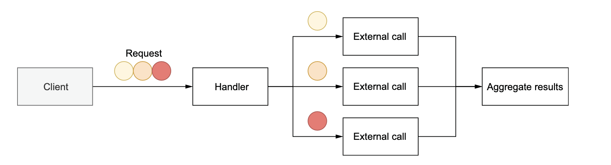

# Go Mistakes

## Table of Contents
- Handling Error Twice
- Being puzzled about channel size
- Not using errgroup
- Not closing transient resources
- Ignoring the fact that elements are copied in range loops

---

## Handling Error Twice

### Problem
```go
func GetRoute(srcLat, srcLng, dstLat, dstLng float32) (Route, error) { 
    err := validateCoordinates(srcLat, srcLng)
    if err != nil {
        log.Println("failed to validate source coordinates")
        return Route{}, err
    }
    err = validateCoordinates(dstLat, dstLng)
    if err != nil {
        log.Println("failed to validate target coordinates")
        return Route{}, err
    }
    return getRoute(srcLat, srcLng, dstLat, dstLng)
}

func validateCoordinates(lat, lng float32) error {
    if lat > 90.0 || lat < -90.0 {
        log.Printf("invalid latitude: %f", lat)
        return fmt.Errorf("invalid latitude: %f", lat)
    }
    if lng > 180.0 || lng < -180.0 {
        log.Printf("invalid longitude: %f", lng)
        return fmt.Errorf("invalid longitude: %f", lng)
    }
    return nil
}
```

Output as follows:
```output
2021/06/01 20:35:12 invalid latitude: 200.000000
2021/06/01 20:35:12 failed to validate source coordinates
```

---

### Solution

```go
func GetRoute(srcLat, srcLng, dstLat, dstLng float32) (Route, error) { 
    err := validateCoordinates(srcLat, srcLng)
    if err != nil {
        return Route{}, fmt.Errorf("failed to validate source coordinates: %w", err)
    }

    err = validateCoordinates(dstLat, dstLng)
    if err != nil {
        return Route{}, fmt.Errorf("failed to validate target coordinates: %w", err)
    }
    
    return getRoute(srcLat, srcLng, dstLat, dstLng)
}

func validateCoordinates(lat, lng float32) error {
    if lat > 90.0 || lat < -90.0 {
        return fmt.Errorf("invalid latitude: %f", lat)
    }
    if lng > 180.0 || lng < -180.0 {
        return fmt.Errorf("invalid longitude: %f", lng)
    }
    return nil 
}
```

Output as follows:
```
2021/06/01 20:35:12 failed to validate source coordinates:
    invalid latitude: 200.000000
```
[Content Query API example](https://gitlab.trendyol.com/-/ide/project/discovery/indexing-pdp/content-query-api/edit/develop/-/application/)

---

## Being puzzled about channel size

- Channels are a concurrency abstraction to enable communication among goroutines.

- Channels can be buffered or unbuffered.
  
- Unbuffered channel is a channel without capacity. It can be created as
  
```go
ch1 := make(chan int)
ch2 := make(chan int, 0)
```

- Buffered channel has a capacity and must be created with a size greater than 0.

```go
ch3 := make(chan int, 1)
```

- With a buffered channel, a sender can send messages while the channel isn’t full. Once the channel is full, it will block until a receiver goroutine receives a message.

```go
ch3 := make(chan int, 1)
ch3 <-1 // non-blocking
ch3 <-2 // blocking
```

---

### What is the difference between them?

- An unbuffered channel enables synchronization (like mutex). We have the guarantee that two goroutines will be in a known state: one receiving and another sending a message.
  
- A buffered channel doesn’t provide any strong synchronization. Indeed, a producer goroutine can send a message and then continue its execution if the channel isn’t full. The only guarantee is that a goroutine won’t receive a message before it is sent.

--- 

## Not using errgroup



### The problem

```go
func handler(ctx context.Context, circles []Circle) ([]Result, error) {
    results := make([]Result, len(circles))
    wg := sync.WaitGroup{}
    wg.Add(len(results))
    for i, circle := range circles {
        i = i
        circle = circle
        go func() {
            defer wg.Done()
            result, err := foo(ctx, circle)
            if err != nil {
                // ?
            }
            results[i] = result
        }()
    }
    wg.Wait()
}
```

### Possibly Solutions

- Just like the results slice, we could have a slice of errors shared among the goroutines. Each goroutine would write to this slice in case of an error. We would have to iterate over this slice in the parent goroutine to determine whether an error occurred (O(n) time complexity).

- We could have a single error variable accessed by the goroutines via a shared mutex.

- We could think about sharing a channel of errors, and the parent goroutine would receive and handle these errors.

Not: All of them is pretty complex :/ But There is a better way to do it **errgroup**

`go get golang.org/x/sync/errgroup`

```go
func handler(ctx context.Context, circles []Circle) ([]Result, error) {
    results := make([]Result, len(circles))
    g, ctx := errgroup.WithContext(ctx)

    for i, circle := range circles {
        i = i
        circle = circle
        g.Go(func() error{
            result, err := foo(ctx, circle)
            if err != nil {
                return err 
            }
            results[i] = result
            return nil
        })
    }
    
    if err := g.Wait(); err != nil {
        return nil, err
    }
    return results, nil
}
```

- Let’s imagine we have to trigger three parallel calls:
- The first returns an error in 1 millisecond.
- The second and third calls return a result or an error in 5 seconds.

We want to return an error, if any. Hence, there’s no point in waiting until the second and third calls are complete. Using errgroup.WithContext creates a shared context used in all the parallel calls. Because the first call returns an error in 1 millisecond, it will cancel the context and thus the other goroutines. So, we won’t have to wait 5 sec- onds to return an error. This is another benefit when using errgroup.

---

## Not Closing Transient Resources: Http Body

### Problem

```go
type handler struct {
    client http.Client
    url    string
}

func (h handler) getBody() (string, error) {
    resp, err := h.client.Get(h.url)
    if err != nil {
        return "", err
    }
    body, err := io.ReadAll(resp.Body)
    if err != nil {
        return "", err
    }
    return string(body), nil
}
```

- This method looks OK, and it correctly returns the HTTP response body. However, there’s a resource leak. :thinking:

### Solution
```go
defer func() {
    err := resp.Body.Close()
    if err != nil {
        log.Printf("failed to close response: %v\n", err)
    }
}()
```

##### We should also understand that a response body must be closed regardless of whether we read it.

```go
func (h handler) getStatusCode(body io.Reader) (int, error) { 
    resp, err := h.client.Post(h.url, "application/json", body) 
    if err != nil {
        return 0, err
    }
    defer func() { // close response body even if we don't read it
        err := resp.Body.Close()
        if err != nil {
            log.Printf("failed to close response: %v\n", err)
        }
    }()

    return resp.StatusCode, nil
}
```

Want to learn better sugar way :D 

```go
func (h handler) getStatusCode(body io.Reader) (int, error) {
    resp, err := h.client.Post(h.url, "application/json", body)
    if err != nil {
        return 0, err
    }

    _, _ = io.Copy(io.Discard, resp.Body)
    return resp.StatusCode, nil
}
```

[Badge Consumer Example](https://gitlab.trendyol.com/discovery/indexing-pdp/badge-consumer/-/blob/develop/pkg/client/invalidationapi/invalidation_api.go#L77)

[Meta Partial Example](https://gitlab.trendyol.com/discovery/indexing-pdp/meta-partial-invalidation-consumer/-/blob/develop/pkg/client/spda_read_api.go#L72)

---

## Ignoring the fact that elements are copied in range loops

```go
s := []string{"a", "b", "c"}
for i, v := range s {
    fmt.Printf("index=%d, value=%s\n", i, v)
}
```

```go
type account struct {
    balance float32
}

accounts := []account{
    {balance: 100.},
    {balance: 200.},
    {balance: 300.},
}
for _, a := range accounts {
    a.balance += 1000
}
```

Answer :thinking:

```go
for i := range accounts {
    accounts[i].balance += 1000
}
// or
for i := 0; i < len(accounts); i++ {
    accounts[i].balance += 1000
}
```
