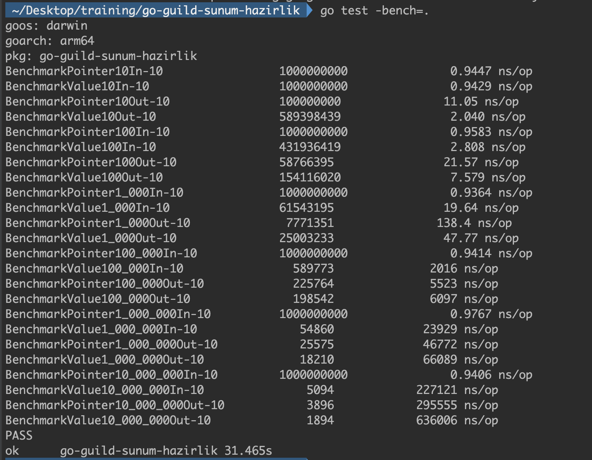

# Good to know these Go Tricks

Abdulsamet İleri 

---

# Table of contents
- Pointer Passing Performance
- Pointer Receiver Nil Check
- Custom Marshal/Unmarshal Functions
- Read HttpBody even if don't need to read
- Run your code exactly once (Singleton)
- The beautify of `sync.Pool` 
- Closely look at `worker pool` pattern

---

# Pointer Passing Performance

- If a struct is large enough, using a pointer to the struct as either an input parameter or a return value improves performance.

<!--
Herhangi bir data size'in pointerini geçmek sabit 1ns'dır. Çünkü tüm data sizelar için pointer'in size'ı aynıdır. 
Fakat eğer value geçersek, bu value boyutu ile zaman arasında doğru orantı olduğunu görürüz. Mesela 10mb için 0.7ms.
-->



- if you are passing megabytes of data between functions, consider using a pointer even if the data is meant to be immutable.
  
[Benchmark tests](https://github.com/learning-go-book-2e/ch06/blob/main/sample_code/pointer_perf/perf_test.go)

---

# Pointer receiver Nil Check

- Go allows you to call a method on a nil receiver.

```go
type IntTree struct {
    val         int
    left, right *IntTree
}

func (it *IntTree) Insert(val int) *IntTree {
    if it == nil {
        return &IntTree{val: val}
    }
    if val < it.val {
        it.left = it.left.Insert(val)
    } else if val > it.val {
        it.right = it.right.Insert(val)
    }
    return it
}

func main() {
    var it *IntTree
    it = it.Insert(5)
    it = it.Insert(3)
    it = it.Insert(10)
}
```

- In value receiver, it is not possible to check nil and panic comes

```go
type Person struct {
	Name    string
	Surname string
}

func (p Person) FullName() string {
	return p.Name + " " + p.Surname
}

func main() {
	var p1 Person
	p1.FullName()

	var p2 *Person
	p2.FullName() // throws panic
}
```

---

# Custom Marshal/Unmarshal Functions

- When Go is encoding a particular type to JSON,it looks to see if the type has a MarshalJSON() method implemented on it. If it has, then Go will call this method to determine how to encode it.

```go
type Marshaler interface { 
    MarshalJSON() ([]byte, error) 
}
```

- When Go is decoding some JSON, it will check to see if the destination type satisfies the json.Unmarshaler interface. If it does satisfy the interface, then Go will call it’s UnmarshalJSON() method to determine how to decode the provided JSON into the target type.

```go
type Unmarshaler interface { 
    UnmarshalJSON([]byte) error 
}
```

```go
func (payload *MessagePayload) UnmarshalJSON(data []byte) error {
	type innerPayload MessagePayload
	inner := &innerPayload{}

	if err := json.ConfigWithDisallowUnknownFields.Unmarshal(data, inner); err != nil {
		return err
	}

	if inner.ContentID == 0 {
		return errors.New("invalid message content id must not be zero")
	}

	if inner.Culture == "" {
		return errors.New("ignore empty culture")
	}

	uppercaseReason := strings.ToUpper(string(inner.Reason))
	inner.Reason = Reason(uppercaseReason)

	if inner.Culture != "tr-TR" && !strings.Contains(uppercaseReason, "INT_") {
		return errors.New("international message with without INT_ prefix reason")
	}

	if inner.Reason == "" {
		inner.Reason = ReasonBrand
	}

	*payload = MessagePayload(*inner)
	return nil
}

// ... 

var msg invalidation.MessagePayload
msg.UnmarshalJSON(kafkaMessage.Value)
```

---

# Read HttpBody even if don't need to read

- If we close the body without a read, the default HTTP transport may close the connection.

- If we close the body following a read, the default HTTP transport won’t close the connection; hence, it may be reused.

```go
func (h handler) getStatusCode(body io.Reader) (int, error) {
    resp, err := h.client.Post(h.url, "application/json", body)
    if err != nil {
        return 0, err
    }
    defer resp.Body.Close()

    _, _ = io.Copy(io.Discard, resp.Body)
    return resp.StatusCode, nil
}
```

---

# Run your code exactly once

- If GetLocationByZoneID is called more than once, once.Do will not execute the closure again.

```go
var (
	locationByZoneIDInstance *LocationByZoneID
	once                     sync.Once
)

func GetLocationByZoneID() *LocationByZoneID {
	once.Do(func() {
		locationByZoneIDInstance = &LocationByZoneID{
			mu:    &sync.RWMutex{},
			store: make(map[string]*time.Location),
		}
	})
	return locationByZoneIDInstance
}

func (m *LocationByZoneID) GetLocation(zoneID string) (*time.Location, bool) {
	m.mu.RLock()
	defer m.mu.RUnlock()

	val, ok := m.store[zoneID]
	return val, ok
}

func (m *LocationByZoneID) SetLocation(zoneID string) *time.Location {
	tzInZone, _ := time.LoadLocation(zoneID)

	m.mu.Lock()
	m.store[zoneID] = tzInZone
	m.mu.Unlock()

	return m.store[zoneID]
}
```

---

# The beautify of sync.Pool

```go
var bufferPool = sync.Pool{
	New: func() any { return newBuffer() },
}

func newBuffer() *bytes.Buffer {
	b := new(bytes.Buffer)
	b.Grow(65536)
	return b
}

func acquireBuffer() *bytes.Buffer {
	return bufferPool.Get().(*bytes.Buffer)
}

func releaseBuffer(b *bytes.Buffer) {
	if b != nil {
		b.Reset()
		bufferPool.Put(b)
	}
}
```

---

# Closely look at `worker pool` pattern

```go
type workerPool struct {
	wg    sync.WaitGroup
	limit chan struct{}
}

func (l *workerPool) acquire() {
	l.wg.Add(1)
	l.limit <- struct{}{}
}

func (l *workerPool) wait() {
	l.wg.Wait()
}

func (l *workerPool) release() {
	<-l.limit
	l.wg.Done()
}
```

```go
func (g *gcs) BatchConsume(messages []*kafka.Message) error {
	fmt.Printf("Total number of messages %d\n", len(messages))

	workers := &workerPool{limit: make(chan struct{}, 100)}
	for i := range messages {
		workers.acquire()

		go func(message *kafka.Message) {
			defer workers.release()
			g.process(message)
		}(messages[i])
	}
	workers.wait()

	return nil
}
```