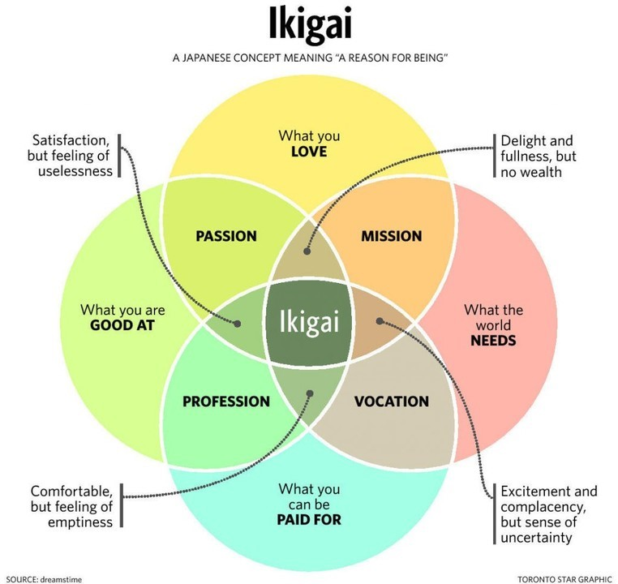

# IKIGAI

* İkigai **hep meşgul kalarak mutlu olma** demek olduğu gibi bir diğer anlamı ise **yaşamdaki varoluş sebebi**.

* Japonlara göre herkesin bir ikigai'si var. Onu bulmak içinde ciddi sabır içerisinde bir arayışta olmak gerek. 

* İkigainizi keşfederken kendinize sorabileceğiniz sorular ise, **neyi yapmayı gerçekten seviyorsunuz**, **neyi yapmada çok iyisiniz**, **dünyanın sizin neyi yapmanıza ihtiyacı var** ve son olarak **ne yaparak para kazanabilirsiniz**, bu 4 sorunun cevabının keşiştiği eylem sizin bu dünyada yapmanız gereken aktivitedir.

* Net bir şekilde belirlenen ikigai hayatlarımıza tatmin, mutluluk ve anlam getirir.

# Ikigainin 10 kuralı

1. Aktif kalın, emekli olmayın.
2. Ağırdan alın, aceleci olmayın.
3. Midenizi tıka basa doldurmayın. (%80 Kuralı)
    - çok tabaklı sunum
4. Çevrenizle iyi arkadaşlarınız olsun.
5. Bir sonraki doğum gününüze kadar şekle girin.
6. Gülümseyin.
7. Doğayla tekrar bağlantı kurun
8. Teşekkürlerinizi sunun (İlişkili olduğunuz her şeye)
9.  Anı yaşayın
10. Ikigai'nizi takip edin

# Kitaptan Bazı Önemli Noktalar

- Büyük bir hedefle karşı karşıya kaldığınızda, onu parçalara ayırmayı ve tek tek üstüne gitmeyi deneyin.

- Mutluluk sonuçta değil, süreçtedir. (Meditasyon örneği)

- Yaşamdaki mutluluğun ana şartları: Yapacak bir şey, sevecek biri ve umut edecek bir şey.

- Uzun ömürlü insanların ortak özellikleri `olumlu bir tutum` ve yüksek derecede `duygusal farkındalıktır`. Başka bir deyişle zorluklara olumlu bir bakış açısıyla yaklaşan ve duygularını yönetebilenler uzun ömürlü olma yolundadır.

- Olumsuz duyguları bırakma fikri: Direğe iple bağlanan bir eşek kendini kurtarmak için direğin etrafında dönüp durunca direğe daha yapışık, hareket edemez halde kalır. Aynı şey korkularından ve rahatsızlıklarından kurtulmaya çalışıp acılarına daha fazla saplanan obsesif düşünme biçimine sahip insanlar içinde geçerlidir.
  
- Öfkeliyseniz ve kavga etmek istiyorsanız, harekete geçmeden önce üç gün düşünün. Üç gün sonra, yoğun kavga etme arzusu kendi kendine geçecektir.

- _Akışı yakalamak ile ilgili_: Bir yazarın üç ayda bir kitabı bitirmesi gerektiğini hayal edin. Amaç nettir, sorun yazarın bunu takıntı haline getirmeyi bırakamamasıdır. Her gün, "Bu kitabı yazmalıyım" diyerek uyanır. Ama her gününü gazete okuyup evi temizleyerek geçirir. Her akşam kendini öfkeli hisseder ve ertesi gün çalışmaya başlayacağına söz verir.Günler, haftalar, aylar geçer ve tek bir kelime bile yazamamıştır. Aslında tüm yapması gereken oturup ilk kelimesini yazmak. Sonuç: İşe koyulmaktan çok hedefe sabitlenme yapmamalıyız!