<style scoped>
    h1 {
        font-size: 90px;
    }
</style>

# Kafka Konsumer & Cronsumer libraries

---

# Agenda

- What is Kafka Cronsumer and Konsumer?
- Kafka Konsumer Features with real-life examples
- How Kafka Cronsumer is work? What is it's features?
- Conclusion

---

# Me

- Backend dev, 2.5 years on Ty.
- Seller product indexing team _(aggregation domain)_
<!-- 
total 3 trilyon content
stock, price, variant, category, listing etc.
kafka ile çok haşir neşiriz
-->

--- 

# Kafka Cronsumer
<!-- 
İhtiyaçı anlatalım, 
tüm consumerlar için eventual consistent handling 
-->
- [**Kafka Cronsumer**](https://github.com/Trendyol/kafka-cronsumer) is mainly used for retry/exception strategy management. It works based on **cron** expression and consumes messages in a timely manner with the power of auto pause and **concurrency**.
- `v1.0.0` Jun 5, 2023, currently `v1.5.5`,  `14` contributors
- Used by `100+` projects
- Uses [segmentio/kafka-go](https://github.com/segmentio/kafka-go)

<!-- 
- high level kafka support api
- context support
-->

---

# Kafka Konsumer
<!--
Önce neden çıktı ondan bahsedelim,
bir sürü consumer projesinde ihtiyaç olan
- boilerplate Kafka initialization codes
- to handle exceptions with an eventual strategy
- exposing processed event metrics, defining alerts, and more!
-->

- [**Kafka Konsumer**](https://github.com/Trendyol/kafka-konsumer)
provides an easy implementation of Kafka consumer with a built-in retry/exception manager (kafka-cronsumer)
- `v1.0.0` Jun 5, 2023, currently `v2.4.6`,  `21` contributors
- Used by `100+` projects
- Uses [segmentio/kafka-go](https://github.com/segmentio/kafka-go)
  
---

# Kafka Konsumer Features

- Built-in retry/exception handling support
- High-performance batch-consuming
- Distributed Tracing (Opentelemetry) support
- Pause/Resume consumer any time
- Run pre-batch function for batch mode
- Error-Only Retry for batch consuming
- Skip Message By Header Feature
- Metric collector support (exposed useful metrics)
- Scram — Plain Text Authentication & TLS Support
- Kafka Producer Support

---

# High-Performance batch consuming

| 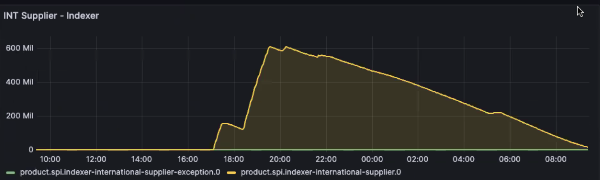 | 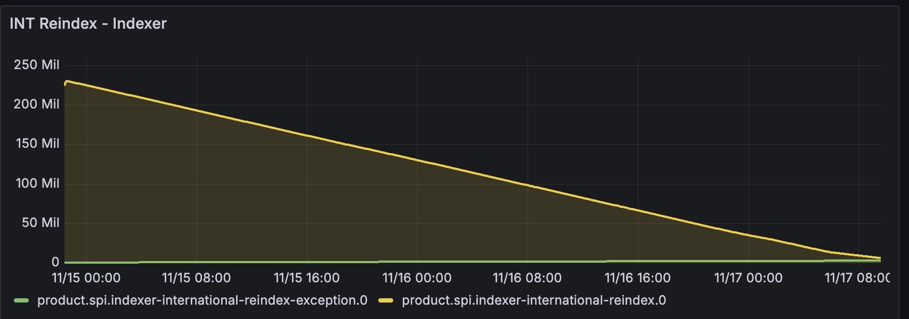 |
|---------------------------------|------------------------------|
| 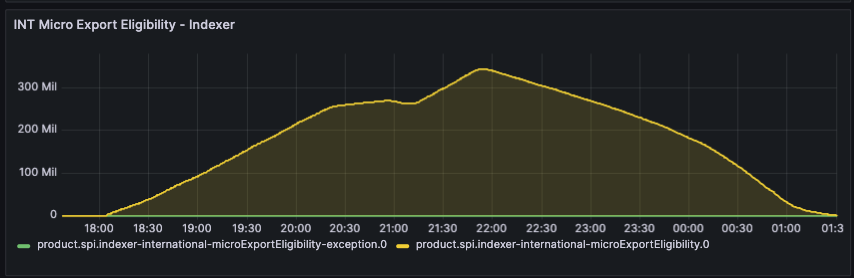    | 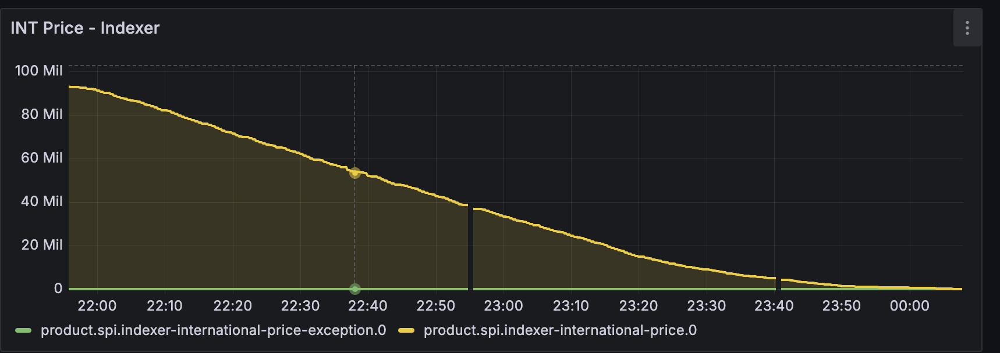  |

<!-- segmentio da batch consumer diye bir şey olmaması. Bizim üzerine bir katman ile yazmamız -->

---

# Feature: Distributed Tracing Support

- `segmentio/kafka-go` has no opentelemetry support. [otel-kafka-konsumer](https://github.com/Trendyol/otel-kafka-konsumer) born!

<!--otel kafka konsumer'ı dist tracing segmentio ya entegre hali gibi düşünebiliriz. -->

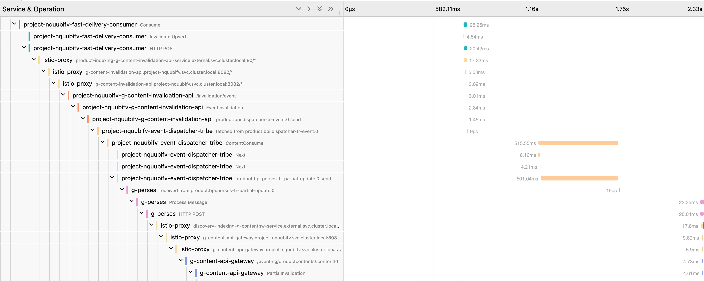

<!--tek satır bir boolean flag vererek, enable edebiliyoruz -->

--- 

# Feature: Pause/Resume consumer

```go
consumer, _ := kafka.NewConsumer(consumerCfg)
defer consumer.Stop()

consumer.Consume()

consumer.Pause()
// ..
consumer.Resume()
```

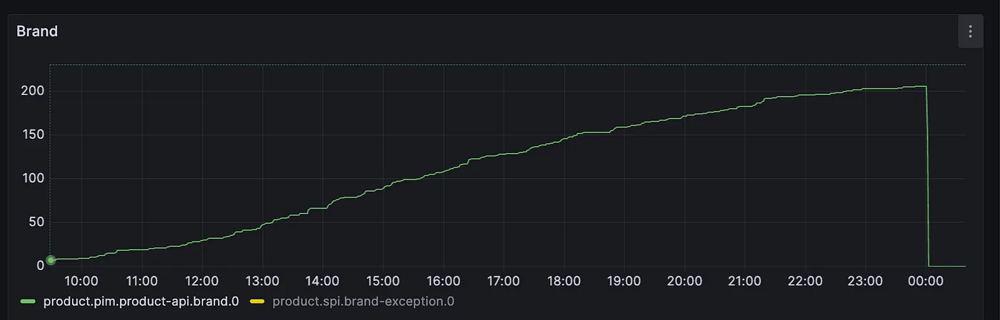

<!--Sisteme yük oluşturabilecek eventları gece işleme 
1 brand eventi, milyonlarca content'e hit edebilir.
-->

---

# Feature: Run pre-batch function for batch mode

- `PreBatch` functions benefits _(same-key compaction, merging, pre-processing)_

<!--
Compaction: same key ile
Merging: Birbiri ile related eventleri birleştirme mesela n listing -> content bazlı birleştirme
pre processing: event ignore, deserialization check
 -->

<!--Use case: category events -->
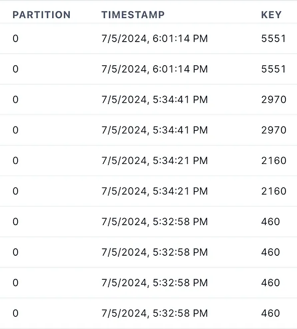

---

- Before Prebatch
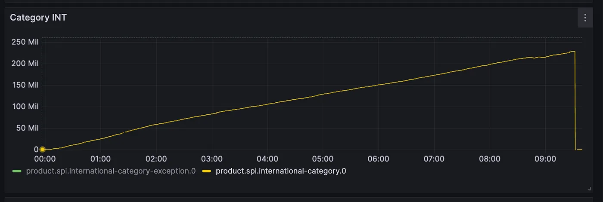
<!--
Consumer'ı kapattık
gece işleniyor birde. 
-->

---

- After Prebatch
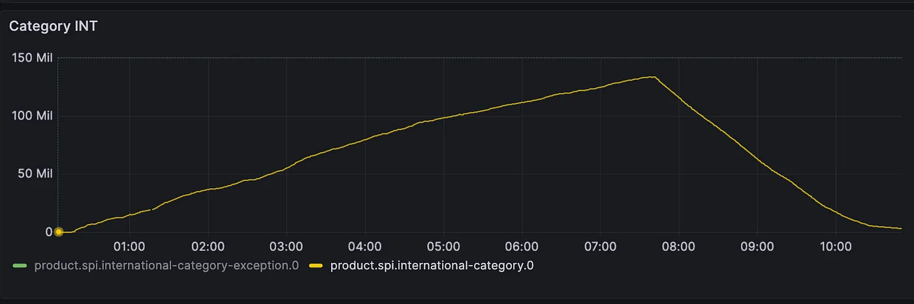

---

- Merging listing events
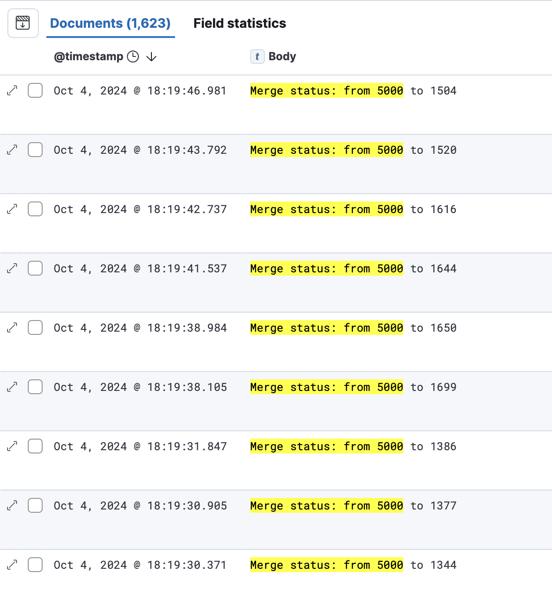

---

# Feature: Error-Only Retry for batch consuming

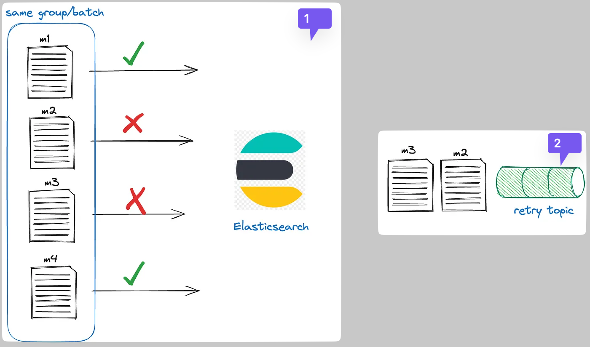

---

# Feature: Skip Message By Header Feature

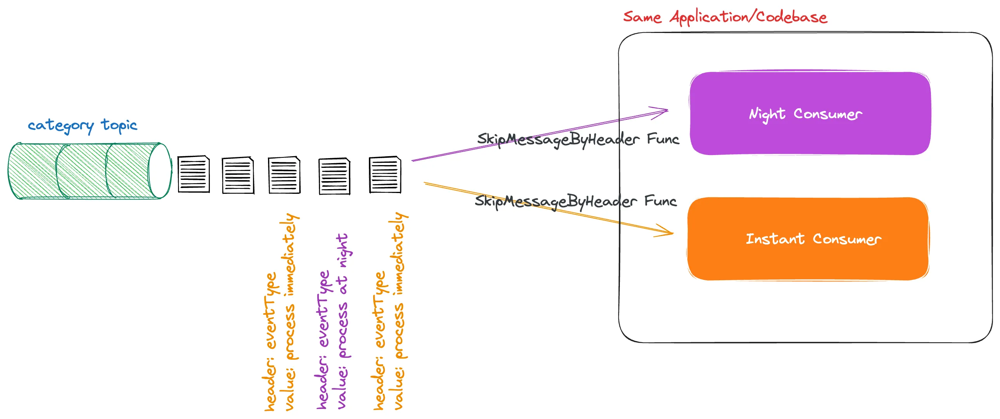

---

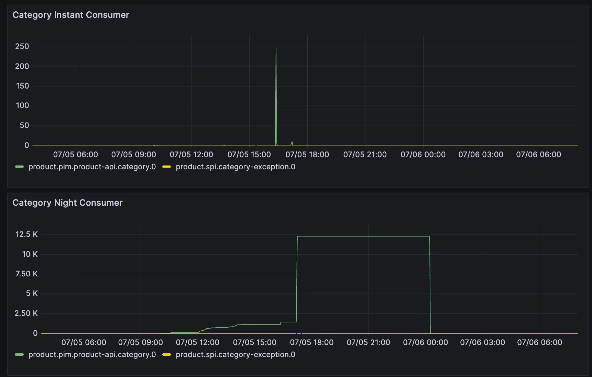

---

# Behind the scenes: Kafka Cronsumer

| 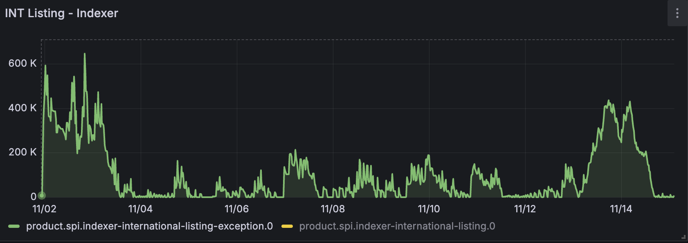 | 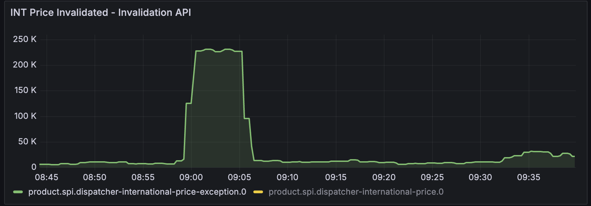 |
|---------------------------------|------------------------------|
| 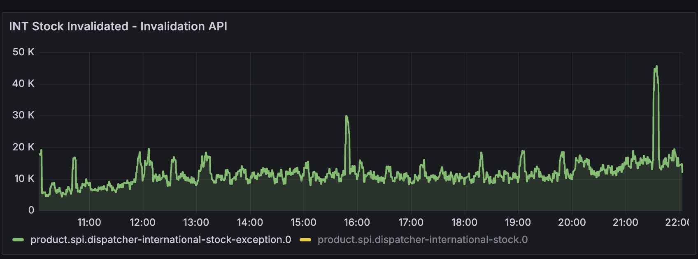    | 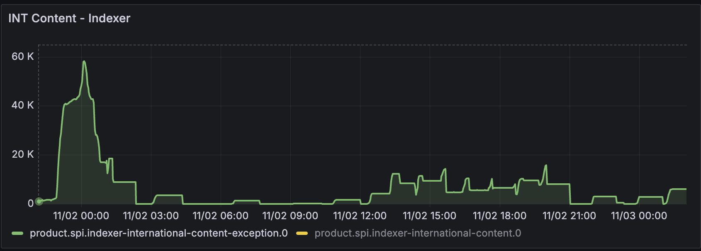  |

---

# Architecture

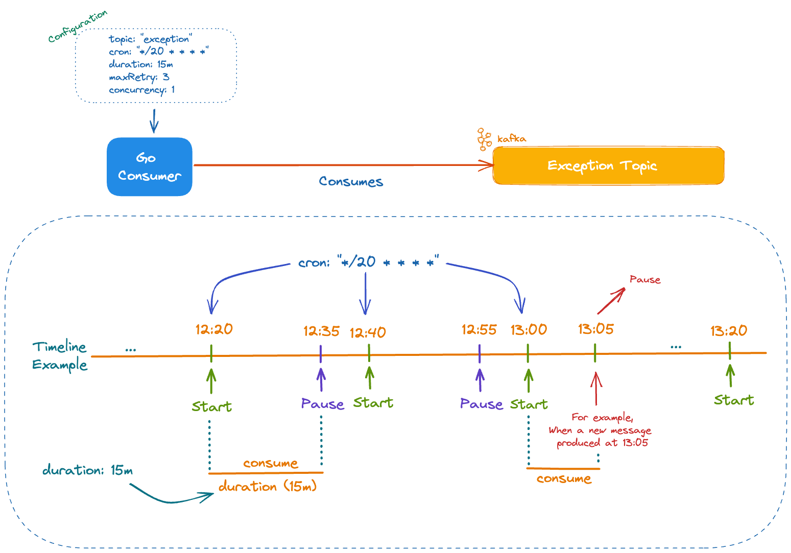

---

# Kafka Cronsumer Features

- Deadletter support
- Backoff strategy support _(linear, fixed, and exponential options)_
- Header filter support
- Metric Collector support
  - kafka_cronsumer_retried_messages_total
  - kafka_cronsumer_discarded_messages_total
- `x-error-message` support 
<!--bir mesajın neden exception topic'e düştüğünü bu header'a bakarak görebiliyoruz -->

You can find a number of ready-to-run examples at [this directory.](https://github.com/Trendyol/kafka-cronsumer/tree/main/examples)

---

# Kafka Cronsumer:  When to use it? 🤔

- Iteration-based back-off strategies are applicable
- Messages could be processed in an eventually consistent state
- Max retry exceeded messages could be ignored
- To increase consumer resiliency
- To increase consumer performance with concurrency

---

# Kafka Cronsumer: When to avoid? ❗️

- Messages should be processed in order
- Messages should be certainly processed _(we discard messages if max retry is exceeded or move to dead letter topic)_
- Messages should be committed _(we use auto-commit interval for increasing performance)_
- Messages with TTL (Time to Live)

---

Thank you to all contributors

|  |  |
|--------------------------------|-------------------------------|

---

# Conclusion

Thank you for listening

- https://github.com/Trendyol/kafka-konsumer


- https://github.com/Trendyol/kafka-cronsumer


---

# Contact us

- #kafka-konsumer
- https://pandora.trendyol.com/qa/kafka-konsumer

We are open to hearing your voice and feedback. 
Don’t hesitate to contact us and give ⭐️️ ⭐ ⭐️ 😄