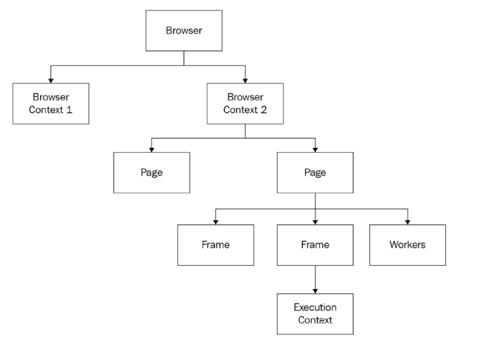
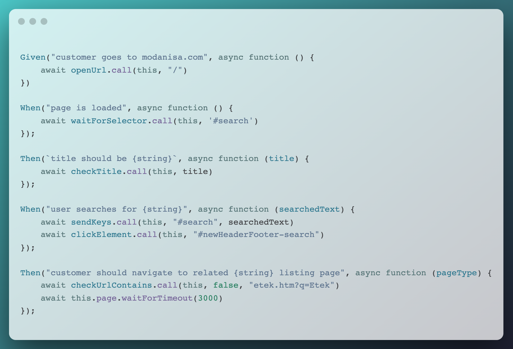

# ATDD

Outline olabilir

---

# Acceptance Nedir?


---

# What is Puppeteer?

Puppeteer is nothing more, and nothing less, than a Node.js package that knows how to open a browser, send commands, and react to messages coming from that browser.

The first thing you need to know is that `Puppeteer` was not created to compete with `Selenium`. `Selenium` is a cross-language, cross-browser testing tool, whereas Puppeteer was created as a multi-purpose automation tool to exploit all the power of Chromium.

---

# The Puppeteer Object Model



---

# The Puppeteer Object Model cont.

- A browser can contain more than one context. **A context is a browser session** (not to be confused with a browser window). The best example is the Incognito Mode or private mode, depending on the browser, which creates an isolated session inside the same browser process.

- A **page** is a tab in a browser or even a pop-up page.

- Every page has at least one frame, which is called the main frame. *(page.click calls mainframe.click)*

- The **execution context** is a mechanism Chromium uses to isolate the page from the browser extensions. **Each frame will have its own execution context.** Internally, all the frame functions that involve executing JavaScript code will use an execution context to run the code inside the browser.

---

# Init `puppeteer launch` function

```javascript
const defaultOptions = {
    args: ['--window-size=1920,1080'],
    ignoreHTTPSErrors: true,
    defaultViewport: {width: 1920, height: 1080},
    headless: false,
}
this.config = {...defaultOptions, ...puppeteerOptions, ...this.worldParameters};
this.browser = await puppeteer.launch(this.config);
this.page = await this.browser.newPage();
```
* **ignoreHTTPSErrors**: Whether to ignore HTTPS errors during navigation. This option will become handy when you want to automate websites with invalid or missing SSL certificates.
* a **viewport** is the visible portion of the entire document.
* A **headless** browser is a browser that you can launch and interact with using a particular protocol over a particular communication transport, with no UI involved.

---

# Template

[Our Puppeteer & Cucumber Template](https://github.com/patheard/cucumber-puppeteer)

[Our Repo](https://github.com/modanisa/bootcamp-project-acceptance)

---

# Action Funcs

```
action
├── clickElement.js
├── deleteCookie.js
├── fileUpload.js
├── keyboardPress.js
├── openUrl.js
├── resizeScreenSize.js
├── scrollToElement.js
├── sendKeys.js
├── setElementStyle.js
├── setElementValue.js
├── setUserAgent.js
├── waitFor.js
└── waitForSelector.js
```

---

# Check Funcs

```
check
├── checkAccessibility.js
├── checkAttribute.js
├── checkAttributeContains.js
├── checkContainsText.js
├── checkCookieExists.js
├── checkCookieValue.js
├── checkElementEnabled.js
├── checkElementExists.js
├── checkElementValue.js
├── checkElementVisible.js
├── checkHasFocus.js
├── checkIsChecked.js
├── checkIsEmpty.js
├── checkScreenshot.js
├── checkTitle.js
├── checkTitleContains.js
├── checkUrl.js
└── checkUrlContains.js
```

---

