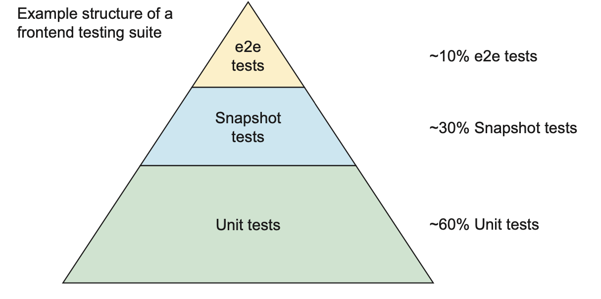
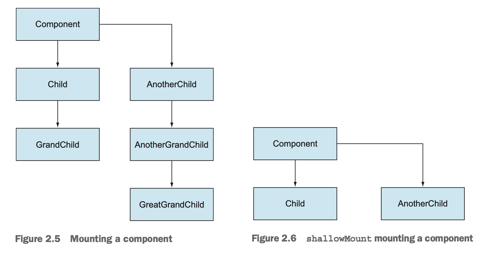

# Testing Vue.js Applications

- Testing (Manual, Automated, Journey, Regression, e2e, Unit, Snapshot)
- Vue infrastructure (SFC, Rendering Components)
- Webpack, linting, jest transformers
- Vue test utils
- Mounting Vue Instance
- Simulating User Interaction
- Manipulating Component State
- Mocking Props
- Mocking API Calls
- Using `call` on tests

---

* **Testing** an application is the process of checking that an application behaves correctly. Testing is not always beneficial. If a test doesn’t save you time, then it’s not
worth writing.

* **Manual testing** is where you check that an application works correctly by interacting with it yourself. 

* **Automated testing** is the process of using programs to check that your software works correctly.

---

* A **user journey** is a list of steps that a user can take through an application. For example—open application, fill out form, click submit. (*journey testing*)

* Although some of our manual testing time was spent testing new features, most was taken up testing old features to check they still worked. This kind of testing is known as **regression testing**. Regression tests are difficult tasks for us humans to do—they’re repetitive, they require a lot of attention, and there’s no creative input. Put simply, they’re boring. Luckily, computers are great at tasks like these, and that’s where automated testing comes in!

---

* In frontend applications, **end-to-end tests** automate a browser to check that an application works correctly from the user’s perspective.

```javascript
function testCalculator(browser) {
  browser
    .url('http://localhost:8080')
    .click('#button-1')
    .click('#button-plus')
    .click('#button-1')
    .click('#button-equal')
    .assert.containsText("#result", "2")
    .end();
}
```

--- 

* **Unit testing** is the process of running tests against the smallest parts of an application (units). Normally the units you test are functions, but in Vue apps, **components are also units to test**

* **Snapshot tests** are similar to Spot the Difference. A snapshot test takes a picture of your running application and compares it against previously saved pictures.

---



- Unit tests are fast
- Snapshot tests are fast too
- e2e is hard to debug and time consuming.

---

* Creating a Vue instance that generates DOM nodes is known as mounting an instance.

* You can describe the DOM nodes in two main ways: `templates and render functions.`

```javascript
new Vue({
  // ..
  template: '<div>{{message}}</div>',
// .. })
```

For Vue to use to generate DOM nodes from a template, it needs to convert the template into `render functions` -—known as *compiling the template.*

```javascript
new Vue({
  // ..
  render(createElement) {
    return createElement('div', this.message)
},
// .. })
```

---

Vue runs render functions to generate a `virtual DOM` --which is a JavaScript representation of the real DOM.

```javascript
{
  tag: 'div',
  children: [
    {
      text: 'Hello Vue.js'
    } 
  ]
}
```

---

# A single-file component (SFC)

```javascript
<template>
  <div>{{message}}</div>
</template>
<script>
  export default {
    data: {
      message: 'Hello Vue.js!'
    } 
  }
</script>
<style> 
div {
    color: red; 
}
</style>
```

SFCs are not valid JavaScript or HTML. You can’t run them in the browser, so you need to compile SFCs before you send them to the client. 

---

A compiled SFC becomes a JavaScript object with the template converted to a render function.

```javascript
Module.exports = default {
 render() {
    var _vm = this;
    var _h = _vm.$createElement;
    var _c = _vm._self._c || _h;
    return _c('p', [_vm._v("I'm a template")])
},
  name: 'example-template'
}
```

---
# Component Contract

Component inputs:
* Component props
* User actions (like a button click) 
* Vue events
* Data in a Vuex store

Component outputs:
* Emitted events
* External function calls

---
# Basic overview of Webpack

* The most popular JavaScript build tool is **webpack**. Webpack is a module bundler. Its main purpose is to bundle JavaScript files written as modules into a single file for use in a browser, but it’s also capable of transforming, bundling, or packaging other assets, like Vue SFCs.

* In typical Vue App, src (aka source code) directory is bundled by webpack during the build process.

---
# Basic overview of Linting

* **Linting** is the process of checking code for potential errors and formatting issues. Linting is a useful way to enforce code style on a project.

* You can encounter some linter issues using Jest. If linter does not know the jest methods (test, describe etc.) comes from, it gives an lint error. 

```javascript
"env": {
    "node": true,
    "jest": true
},
```
Adding `jest` props true in eslintConfig, resolves error.

---

* The first step when you set up a testing system is to write a simple test to check that the system is set up correctly. This is known as a **sanity test**. 

* A **sanity test** is a test that always passes. If the sanity test fails, you know there is a problem with the test setup.

```javascript
test('sanity test', () => {
  return
})
```

---
# Jest Tranformers

* Vue single-file components aren’t valid JavaScript. You need to compile them before you can use them in a JavaScript application.

* `babel-jest` compiles modern JavaScript into JavaScript that can run in Node, and `vue-jest` compiles SFCs into JavaScript. (Jest transformers)

```javascript
"jest": {
  "transform": {
    "^.+\\.js$": "babel-jest",
    "^.+\\.vue$": "vue-jest"
  }
}
```

---
# Vue Test Utils

* Help us traverse and select elements on the rendered DOM more easily.

* Mount component in isolation

```javascript
const wrapper = mount(Component)
```

* A wrapper is an object that contains a mounted component
and the accompanying methods to help test the component.

```javascript
const vm = wrapper.vm; // Vue instance
const html = wrapper.html(); // retrieve a component's html
const button = wrapper.find('button');
```
--- 

# Mounting Vue Instance (mount vs shallowMount)



---

* When you import a compiled Vue component, it’s just an object (or function) with a render function and some properties.

```javascript
import { shallowMount } from '@vue/test-utils'
import Item from '../Item.vue'
describe('Item.vue', () => {
  test('renders item', () => {
    const wrapper = shallowMount(Item)
    expect(wrapper.text()).toContain('item')
  })
)
```

---

# Simulating User Interaction

```javascript
const Counter = {
  template: `
    <div>
      <button @click="count++">Add up</button>
      <p>Total clicks: {{ count }}</p>
    </div>
  `,
  data() {
    return { count: 0 }
  }
}
```

---

# Simulating User Interaction cont.

```javascript
test('increments counter value on click', async () => {
  const wrapper = mount(Counter)
  const button = wrapper.find('button')
  const text = wrapper.find('p')

  expect(text.text()).toContain('Total clicks: 0')

  await button.trigger('click')

  expect(text.text()).toContain('Total clicks: 1')
})
```

* notice `trigger` needs to be awaited. 
* Vue batches pending DOM updates and applies them asynchronously to prevent unnecessary re-renders caused by multiple data mutations.: `Vue.nextTick()`

---

# Manipulating Component State

```javascript
it('manipulates state', async () => {
  await wrapper.setData({ count: 10 })

  await wrapper.setProps({ foo: 'bar' })
})
```

---

# Mocking Props

```javascript
import { mount } from '@vue/test-utils'

mount(Component, {
  propsData: {
    aProp: 'some value'
  }
})
```

* if component is already mounted, you can use `wrapper.setProps({})` 😉

---

# Testing API call
```javascript
<template>
  <button @click="fetchResults">{{ value }}</button>
</template>
<script>
  import axios from 'axios'
  export default {
    data() {
      return {
        value: null
      }
    },
    methods: {
      async fetchResults() {
        const response = await axios.get('mock/service')
        this.value = response.data
      }
    }
  }
</script>
```

---
# Testing API call cont.

```javascript
import { shallowMount } from '@vue/test-utils'
import flushPromises from 'flush-promises'
import Foo from './Foo'
jest.mock('axios')

it('fetches async when a button is clicked', async () => {
  const wrapper = shallowMount(Foo)
  wrapper.find('button').trigger('click')
  await flushPromises()
  expect(wrapper.text()).toBe('value')
})
```

* `flush-promises` flushes all pending resolved promise handlers.

* A nice rule to follow is to always `await` on mutations like `trigger` or `setProps`. If your code relies on something async, like calling `axios`, add an await to the `flushPromises` call as well
---
# Vue—the master copy

In school, the teacher doesn’t give you the master copy of a workbook to write on. The teacher photocopies it so that you can use it without affecting the original workbook.

Think of the Vue base constructor as the master copy. If you change the Vue base constructor, you change every copy that’s made from Vue in the future. A `localVue` constructor is like a photocopy of the master copy. It’s the same as the original and can be used in the same way, but you can make changes to it without affecting the original.

```javascript
import { createLocalVue, mount } from '@vue/test-utils'
// create an extended `Vue` constructor
const localVue = createLocalVue()
// install plugins as normal
localVue.use(MyPlugin)
// pass the `localVue` to the mount options
mount(Component, {
  localVue
})
```

---

# Testing with `call` example

```javascript
<template>
  <div>
    {{ numbers }}
  </div>
</template>

<script>
export default {
  name: "NumberRenderer",
  props: {
    even: {
      type: Boolean,
      required: true
    }
  },
  computed: {
    numbers() {
      const result = []

      let remainder = this.even ? 0 : 1

      for (let i = 1; i < 10; i++) {
        if (i % 2 === remainder) {
          result.push(i)
        }
      }

      return result.join(", ")
    }
  }
}
</script>
```

---

# Testing will `call` cont.
> with the `mount`:

```javascript
 const wrapper = mount(NumberRenderer, {
  propsData: {
    even: true
  }
 })

 expect(wrapper.text()).toBe("2, 4, 6, 8")
```

> with the `call`:

``` javascript
it("renders odd numbers", () => {
  const localThis = { even: false }
  expect(NumberRenderer.computed.numbers.call(localThis)).toBe("1, 3, 5, 7, 9")
})
```
* we need to use `call`, which lets us bind an alternative `this` object, in our case, one with a `even` property.


---

# To call or to mount?

* You are testing a component that does some time consuming operations in a lifecycle methods you would like to avoid executing in your computed unit test.

* You want to stub out some values on this. Using call and passing a custom context can be useful.

---

# Practice!

[Our Repository](https://github.com/modanisa/bootcamp-project-vue)
